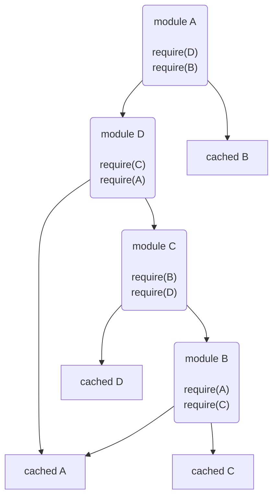

# JavaScript-advanced

## JavaScript API

### SharedArrayBuffer

SharedArrayBuffer 可以被任意多个执行上下文同时使用(并发)

// todo

### Atomics

```js
const buffer = new SharedArrayBuffer(16)
const uint8 = new Uint8Array(buffer)
unit8[0] = 7
// 7+2=9
// 返回旧值 7
Atomics.add(unit8, 0, 2)
// 7-2=5
// 返回旧值 7
Atomics.sub(unit8, 0, 2)
// 0011 & 0010 = 0010
// 返回旧值 7
Atomics.and(uint8, 0, 0b0010)
// 0011 | 0010 = 0111
// 返回旧值 7
Atomics.or(uint8, 0, 2)
// 7 (0111) XOR 2 (0010) = 5 (0101)
// 返回旧值 7
Atomics.xor(uint8, 0, 2)

// 1. 所有原子指令相互之间的顺序永远不会重排
// 2. 位于原子读/写之前的所有指令会在原子读/写发生前完成,
//    而位于原子读/写之后的所有指令会在原子读/写完成后才会开始
// 原子读
Atomics.load(uint8, 0)
// 原子写
Atomics.store(uint8, 0, 2)
```

// todo

### 跨上下文消息 XDM（cross-document messaging）

跨文档消息(XDM), 是一种在不同执行上下文（如不同工作线程或不同源的页面）间传递信息的能力

`postMessage()`消息、表示目标接收源的字符串和可选的可传输对象的数组（只与工作线程相关）

window 对象上触发 message 事件(onMessage), event 包含下面三个信息:

- data 作为第一个参数传递给 postMessage() 的字符串数据
- origin 发送消息的文档源, 例如 "http://www.wrox.com"
- source 发送消息的文档中 window 对象的代理。这个代理对象主要用于在发送上一条消息的窗口中执行 postMessage() 方法。如果发送窗口有相同的源, 那么这个对象应该就是 window 对象

### Encoding API

Encoding API 主要用于实现字符串与定型数组之间的转换。

```js
// 批量编码 解码
const textEncoder = new TextEncoder()
const encodedText = TextEncoder.encode(decodedText)

const textDecoder = new TextDecoder()
const decodedText = TextDecoder.decode(encodedText)

// 流编码 解码
// todo
```

### File API

前端处理文件

File 对象:

- name 文件名
- size 以字节计的文件大小
- type 文件 MIME 类型(文件类型)

#### FileReader

- readAsText(file, encoding)
- readAsDataURL(file)
- readAsBinaryString(file)
- readAsArrayBuffer(file)

事件: progress error load abort

```js
const fileInput = document.getElementById('input')
fileInput.addEventListener('change', (event) => {
  const selectedFile = event.target.files[0]

  const reader = new FileReader()

  reader.onload = (e) => {
    const data = e.target.result
  }

  reader.readerAsText(selectedFile)
})
```

同步版本 FileReaderSync

#### Blob

blob 表示二进制大对象（binary large object）

```js
console.log(new Blob(['foo']))
// Blob {size: 3, type: ""}
console.log(new Blob(['{"a": "b"}'], { type: 'application/json' }))
// {size: 10, type: "application/json"}
```

`var blob = instanceOfBlob.slice([start [, end [, contentType]]]};`

对象 URL 有时候也称作 Blob URL, 是指引用存储在 File 或 Blob 中数据的 URL。对象 URL 的优点是不用把文件内容读取到 JavaScript 也可以使用文件。

`let url = window.URL.createObjectURL(Blob|File)`

`window.URL.revokeObjectURL(url)`

```js
const textData = 'Hello world!'

const blob = new Blob([textData], { type: 'text/plain' })
// 绑定链接 <a></a>
const downloadLink = document.getElementById('a')
downloadLink.href = URL.createOObjectURL(blob)
downloadLink.download = 'example.txt' // 设置下载文件名称

downloadLink.click()

URL.revokeObjectURL(downloadLink.href)
```

### Notifications API

Notifications API 用于向用户显示通知。类似 alert()对话框

- 通知只能在运行在安全上下文的代码中被触发
- 通知必须按照每个源的原则明确得到用户允许

requestPermission() 返回一个期约, 用户在授权对话框上执行操作后这个期约会解决。

```js
Notification.requestPermission().then((permission) => {
  console.log('User responded to permission request:', permission)
})
// granted 用户授权了显示通知的权限
// denied 拒绝

new Notification('Title text! ', {
  body: 'Body text!',
  image: 'path/to/image.png',
  vibrate: true,
})
// 关闭
const n = new Notification('I will close in 1000ms')
setTimeout(() => n.close(), 1000)
```

#### 通知生命周期回调

- onshow 通知显示时触发
- onclick 通知点击时触发
- onclose 通知消失或通过 close()关闭时触发
- onerror 在发生错误阻止通知显示时触发

### Page Visibility API

如果页面被最小化或隐藏在其他标签页后面, 那么轮询服务器或更新动画等功能可能就没有必要了

Page Visibility API 旨在为开发者提供页面对用户是否可见的信息。

- `document.visibilityState`
  - hidden
  - visible
  - prerender
- `visibilitychange` 事件, 该事件会在文档从隐藏变可见（或反之）时触发
- `document.hidden` 布尔值, 表示页面是否被隐藏

### Stream API

#### 流

1. 可读流 由 consumer 进行处理
2. 可写流 由 producer 将数据写入流,数据在内部传入底层数据槽 (sink)
3. 转换流 由两种流组成, 可写流用于接受数据,可读流用于输出数据, 两个流之间是转换程序 transformer

#### 块、内部队列和反压

流的基本单位是块（chunk,）通常是定型数组

流平衡:

- 出口处理数据的速度 > 入口提供数据的速度. 可接受
- 流出和流入均衡 理想
- 出口处理数据的速度 < 入口提供数据的速度比. 需要处理

流不能允许其内部队列无限增大, 因此它会使用反压（backpressure）通知流入口停止发送数据, 直到队列大小降到某个既定的阈值之下

这个阈值由排列策略决定, 这个策略定义了内部队列可以占用的最大内存, 即高水位线（high water mark）。

可读流

```js
// 模拟输入 1,2,3,4,5...
async function* ints() {
  for (let i = 0; i < 5; ++i) {
    yield await new Promise((resolve) => setTimeout(resolve, 1000, i))
  }
}

// 假设输入, 创建一个可读流
const readableStream = new ReadableStream({
  async start(controller) {
    // 使用异步生成器函数 ints() 生成递增整数, 并将它们推送到流中
    for await (let chunk of ints()) {
      controller.enqueue(chunk)
    }
    // 数据推送完毕, 关闭流
    controller.close()
  },
})

// 消费者

;(async function () {
  while (true) {
    const { done, value } = await readableStreamDefaultReader.read()
    if (done) {
      break
    } else {
      console.log(value)
    }
  }
})()
```

可写流

```js
const writableStream = new WritableStream({
  // write 方法会在每次写入时被调用
  write(value) {
    console.log(value)
  },
})

const writableStreamDefaultWriter = writableStream.getWriter()

//生产者
;(async function () {
  for await (let chunk of ints()) {
    await writableStreamDefaultWriter.ready
    writableStreamDefaultWriter.write(chunk)
  }
  writableStreamDefaultWriter.close()
})()
```

转换流

```js
const { writable, readable } = new TransformStream({
  // transform 方法在每个数据块传递时调用
  transform(chunk, controller) {
    // 将传入的数据块乘以 2 并推送到可读流中
    controller.enqueue(chunk * 2)
  },
})

const readableStreamDefaultReader = readable.getReader()
const writableStreamDefaultWriter = writable.getWriter()

// 消费者：从可读流读取数据并进行消费
;(async function () {
  while (true) {
    const { done, value } = await readableStreamDefaultReader.read()
    if (done) {
      break
    } else {
      console.log(value)
    }
  }
})()

// 生产者：将从 ints() 生成器获取的数据块写入可写流
;(async function () {
  for await (let chunk of ints()) {
    await writableStreamDefaultWriter.ready
    writableStreamDefaultWriter.write(chunk)
  }
  writableStreamDefaultWriter.close()
})()
```

#### 管道连接流

使用 pipeThrough() 方法把 ReadableStream 接入 TransformStream

```js
// 创建一个可读流, 生成递增整数块
const integerStream = new ReadableStream({
  async start(controller) {
    for await (let chunk of ints()) {
      controller.enqueue(chunk)
    }
    controller.close()
  },
})

// 创建一个转换流, 将整数块翻倍
const doublingStream = new TransformStream({
  async transform(chunk, controller) {
    // 将接收到的整数块翻倍, 并将结果推送到输出
    controller.enqueue(chunk * 2)
  },
})

// 通过管道连接流：将 integerStream 输入连接到 doublingStream, 得到 pipedStream
const pipedStream = integerStream.pipeThrough(doublingStream)

const pipedStreamDefaultReader = pipedStream.getReader()

// 消费者：从连接流中读取数据并处理
;(async function () {
  while (true) {
    const { done, value } = await pipedStreamDefaultReader.read()
    if (done) {
      break
    } else {
      console.log(value)
    }
  }
})()
```

pipeTo() 方法也可以将 ReadableStream 连接到 WritableStream

```js
// 创建一个可读流, 将递增整数写入流中
const integerStream = new ReadableStream({
  async start(controller) {
    for await (let chunk of ints()) {
      controller.enqueue(chunk)
    }
    controller.close()
  },
})

// 创建一个可写流, 用于输出写入的数据
const writableStream = new WritableStream({
  // write 方法会在每次写入时被调用
  write(value) {
    console.log(value) // 将写入的值打印到控制台
  },
})

// 将可读流连接到可写流, 使数据从可读流流入可写流
const pipedStream = integerStream.pipeTo(writableStream)
```

### 计时 API

Performance 接口 `window.performance`

`performance.now()` 微秒级

`window.performance.timeOrigin` 返回计时器初始化时全局系统时钟的值

- User Timing API 用于记录和分析自定义性能条目
- Navigation Timing API 提供了高精度时间戳, 用于度量当前页面加载速度。
- Resource Timing API 提供了高精度时间戳, 用于度量当前页面加载时请求资源的速度

```js
performance.mark('start')
// performance.getEntriesByType 中的参数 'mark' 'navigate' 'resource'
// 可依次获得上述三个API对象
const [endMark, startMark] = performance.getEntriesByType('mark')

// PerformanceMark {
//     name: "start",
//     entryType: "mark",
//     startTime: 269.8800000362098,
//     duration: 0
// }
```

### Web Components

可重用 定制 ->　元素

#### HTML 模版

- 使用 DocumentFragment

```js
const fragment = new DocumentFragment()
const foo = document.querySelector('#foo')

fragment.appendChild(document.createElement('p'))
// ...

foo.appendChild(fragment)
```

- 使用 template

```html
<div id="foo"></div>
<!-- 在浏览器中渲染时, p 中文本不会被渲染到页面上 -->
<template id="bar">
  <p>...</p>
  <!-- 模版css -->
  <style></style>
  <!-- 模板script -->
  <script>
    console.log('Templatescriptexecuted')
  </script>
</template>
```

```js
const foo = document.querySelector('#foo')
const fragment = document.querySelector('#bar').content

foo.appendChild(fragment)

// 复制模版
foo.appendChild(document.importNode(fragment, true))
```

#### Shadow DOM

`element.attachShadow({ mode: 'open' })`

影子 DOM 的内容会实际渲染到页面上

CSS 样式和 CSS 选择符可以限制在影子 DOM 子树而不是整个顶级 DOM 树中

```js
for (let color of ['red', 'green', 'blue']) {
  // shadow host
  const host = document.createElement('div') // react <></>
  // shadow root
  const shadowRoot = host.attachShadow({ mode: 'open' })

  shadowRoot.innerHTML = `
    <p>Make me ${color}</p>
    <style>
    p{
      color: ${color}
    }
    </style>
    `
}
```

影子 DOM 一添加到元素中, 浏览器就会赋予它最高优先级, 优先渲染它的内容而不是原来的文本

#### slot

`<slot>` 的作用就是给模板元素传值, 增强模板元素的灵活性和通用性。

`name` 的值和 `slot` 的值匹配

```html
<template>
  <div>
    My name is <slot name="username">username</slot>
  </div>
</template>

<my-card>
  <span slot="username">Leo</slot>
</my-card>
<my-card>
  <span slot="username">Louis</slot>
</my-card>
```

#### 自定义元素

`customElements.define(name, constructor, options)`

- `name` 自定义标签名。注意：它不能是单个单词, 且其中必须要有短横线, 比如：my-card 这样的。
- `constructor` 自定义元素构造器, 它可以控制元素的表现形式、行为和生命周期等。
- `options` 一个包含 extends 属性的配置对象, 是可选参数。它指定了所创建的元素继承自哪个内置元素, 可以继承任何内置元素。

```js
class MyCard extends HTMLParagraphElement {
  constructor() {
    super()
    // ...
  }
}
// 注册自定义标签
customElements.define('my-card', MyCard)
```

| 生命周期函数                 | 描述                                                                       |
| ---------------------------- | -------------------------------------------------------------------------- |
| `constructor()`              | 在创建元素实例或将已有 DOM 元素升级为自定义元素时调用。                    |
| `connectedCallback()`        | 在每次将这个自定义元素实例添加到 DOM 中时调用。                            |
| `disconnectedCallback()`     | 在每次将这个自定义元素实例从 DOM 中移除时调用。                            |
| `attributeChangedCallback()` | 在每次可观察属性的值发生变化时调用。初始值的定义也算一次变化。             |
| `adoptedCallback()`          | 在通过 `document.adoptNode()` 将这个自定义元素实例移动到新文档对象时调用。 |

**EXAMPLE**

```html
<template id="card_layout">
  <style>
    * {
      box-sizing: border-box;
    }
    :host {
      display: inline-block;
      width: 400px;
      height: 240px;
      border: 1px solid black;
      border-radius: 10px;
      box-shadow: -2px -2px 5px 0px #7a8489;
    }
  </style>
  <div class="container">
    <!-- 名字 -->
    <div class="card-body">
      <div class="info-column">
        <div class="info-title">name</div>
      </div>
      <div class="info-content">
        <span name="username">Nicholas</span>
      </div>
    </div>
    <!-- 编号 -->
    <div class="card-footer">
      <div class="info-column">
        <div class="info-title">number</div>
      </div>
      <div class="info-content">
        <slot name="number">42</slot>
      </div>
    </div>
  </div>
</template>

<!-- 使用 -->
<my-card>
  <span slot="username"></span>
  <span slot="number"></span>
</my-card>
```

```js
class MyCard extends HTMLElement {
  constructor() {
    super()
    this.shadow = this.attachShadow({ mode: 'open' })
    let tempEle = document.getElementById('card_layout')
    // shadow DOM 复制引入
    this.shadow.appendChild(document.importNode(tempEle.content, true))
  }
}

customElements.define('my-card', MyCard)
```

### Web Cryptography API

密码学算法

```js
// 随机数
const array = new Uint8Array(2)
console.log(crypto.getRandomValues(array))
```

// todo

## JSON

`JSON.stringify()`

1. 过滤结果

```js
let book = {
  title: 'Professional JavaScript',
  authors: ['Nicholas C. Zakas', 'Matt Frisbie'],
  edition: 4,
  year: 2017,
}

// 选择指定参数
// 第二个参数为 数组
let jsonText = JSON.stringify(book, ['title', 'edition'])

// { title: 'Professional JavaScript', edition: 4 }

// 改变参数序列化
// 第二个参数为 函数
let jsonText = JSON.stringify(book, (key, value) => {
  switch (key) {
    case 'authors':
      return value.join(',')
    case 'year':
      return 5000
    case 'edition':
      return undefined
    default:
      return value
  }
})

// {
//   title: 'Professional JavaScript',
//   authors: 'Nicholas C. Zakas, Matt Frisbie',
//   year: 5000,
// }
```

2. 字符串缩进

```js
// 第三个参数控制缩进和空格

let jsonText = JSON.stringify(book, null, 4)

let jsonText = JSON.stringify(book, null, '--')
```

3. toJSON() 方法

```js
// 自定义JSON序列化

let book = {
  //...
  toJSON: function () {
    // 不要用箭头函数, 否则this 是全局作用域
    return this.title
  },
}
// 调用JSON.stringify时, 只会得到字符串
// "Professional JavaScript"
```

`JSON.parse()`

## 网络请求与远程资源

Ajax（Asynchronous JavaScript and XML, 即异步 JavaScript + XML）

### XMLHttpRequest

```js
let xhr = new XHLHttpRequest()
// 请求方式 url 是否异步, false为同步
xhr.open('get', url, false)
xhr.send(body)
```

收到服务器响应后, XHR 的一下属性会被填充数据:

- `responseText`：作为响应体返回的文本。
- `responseXML`：如果响应的内容类型是"text/xml"或"application/xml", 那就是包含响应数据的 XMLDOM 文档。
- `status`：响应的 HTTP 状态。
- `statusText`：响应的 HTTP 状态描述

XHR 对象有一个 readyState, 表示当前处在请求/响应过程的哪个阶段

- 0: Uninitialized 尚未调用 open()
- 1: Open 尚未调用 send()
- 2: Sent 尚未收到响应
- 3: Receiving 收到部分响应
- 4: Complete 收到所有响应

```js
let xhr = new XMLHttpRequest()
xhr.onreadystatechange = function(){
  if(xhr.readyState == 4)
  //
  else
  //
}

xhr.abort() // 取消异步请求
```

#### HTTP 头部

默认情况下, XHR 请求会发送以下头部字段

| 头部字段        | 描述                                            |
| --------------- | ----------------------------------------------- |
| Accept          | 浏览器可以处理的内容类型                        |
| Accept-Charset  | 浏览器可以显示的字符集                          |
| Accept-Encoding | 浏览器可以处理的压缩编码类型                    |
| Accept-Language | 浏览器使用的语言                                |
| Connection      | 浏览器与服务器的连接类型                        |
| Cookie          | 页面中设置的 Cookie                             |
| Host            | 发送请求的页面所在的域                          |
| Referer         | 发送请求的页面的 URI（拼写错误, 应为 Referrer） |
| User-Agent      | 浏览器的用户代理字符串                          |

如果需要发送额外的请求头部, 必须在 open()之后、send()之前调用 `setRequestHeader()`

```js
xhr.open()
xhr.setRequestHeader('MyHeader', 'MyValue')
xhr.send()
// 获取响应头部
let myHeader = xhr.getResponseHeader('MyHeader')
let allHeaders = xhr.getAllResponseHeaders()
```

#### GET POST

```js
function submitData() {
  let xhr = new XMLHttpRequest()
  xhr.onreadystatechange = function () {
    if (xhr.readyState == 4) {
      if ((xhr.status >= 200 && xhr.status < 300) || xhr.status == 304) {
        alert(xhr.responseText)
      } else {
        alert('Request was unsuccessful: ' + xhr.status)
      }
    }
  }
  xhr.open('post', 'post-example.php', true)
  xhr.setRequestHeader('Content-Type', 'application/x-www-form-urlencoded')
  let form = document.getElementById('user-info')
  xhr.send(serialize(form))
}
```

```php
<?php
  header("Content-Type: text/plain");
  echo <<<EOF
  Name: {$_POST['user-name']}
  Email: {$_POST['user-email']}
  EOF;
?>
```

#### FormData 类型

```js
let xhr = new XMLHttpRequest()
xhr.open('post', 'example.php', true)
let form = document.getElementById('form')
xhr.send(new FormDate(form))
```

#### 超时

```js
let xhr = new XMLHttpRequest()
xhr.onreadystatechange = function () {}
xhr.open('get', 'example.php', true)
xhr.timeout = 1000
xhr.ontimeout = function () {
  alert('请求超时')
}
xhr.send(null)
```

超时之后仍会触发 onreadystatechange 事件, readyState 为 4, 但是访问 status 会报错

#### overrideMimeType()方法

用于重写 XHR 响应(服务器)的 MIME 类型

`xhr.overrideMimeType('text/xml')`

必须在调用 send()之前调用 overrideMimeType()

### 进度事件

| 头部字段  | 描述                                               |
| --------- | -------------------------------------------------- |
| loadstart | 在接收到响应的第一个字节时触发。                   |
| progress  | 在接收响应期间反复触发。                           |
| error     | 在请求出错时触发。                                 |
| abort     | 在调用 abort()终止连接时触发。                     |
| load      | 在成功接收完响应时触发。                           |
| loadend   | 在通信完成时, 且在 error、abort 或 load 之后触发。 |

#### progress 事件

每次触发时, onprogress 事件处理程序都会收到 event 对象, 其 target 属性是 XHR 对象, 且包含 3 个额外属性：lengthComputable、position 和 totalSize

### CORS

跨源资源共享（CORS, Cross-Origin Resource Sharing）

对于简单的请求, 在发送时会有一个额外的头部叫 Origin, 包含发送请求的页面的源（协议、域名和端口）。

`Origin: http://www.nczonline.net`

如果服务器决定响应请求, 那么应该发送 Access-Control-Allow-Origin 头部, 包含相同的源；或者如果资源是公开的, 那么就包含"＊"

`Access-Control-Allow-Origin: http://www.nczonline.net`

出于安全考虑, 跨域 XHR 对象也施加了一些额外限制。

- 不能使用 setRequestHeader() 设置自定义头部
- 不能发送和接收 cookie
- getAllResponseHeaders() 方法始终返回空字符串

#### 预检请求 preflight request

CORS 通过一种叫预检请求的服务器验证机制, 允许使用自定义头部、复杂请求, 以及不同请求体内容类型。在发送复杂请求时, 会先向服务器发送一个预检请求, 这个请求使用 OPTIONS 方法发送并包含以下头部:

- Origin：与简单请求相同。
- Access-Control-Request-Method：请求希望使用的方法。
- Access-Control-Request-Headers:（可选）要使用的逗号分隔的自定义头部列表。

在这个请求发送后, 服务器可以确定是否允许这种类型的请求。服务器会通过在响应中发送如下头部与浏览器沟通这些信息：

- Access-Control-Allow-Origin：允许浏览器访问的源。
- Access-Control-Allow-Methods：允许的方法（逗号分隔的列表）。
- Access-Control-Allow-Headers：服务器允许的头部（逗号分隔的列表）。
- Access-Control-Max-Age：缓存预检请求的秒数。

预检请求返回后, 结果会按响应指定的时间缓存一段时间。换句话说, 只有第一次发送这种类型的请求时才会多发送一次额外的 HTTP 请求

#### 凭据请求

默认情况下, 跨源请求不提供凭据（cookie、HTTP 认证和客户端 SSL 证书）。可以通过将 withCredentials 属性设置为 true 来表明请求会发送凭据。如果服务器允许带凭据的请求, 那么可以在响应中包含如下 HTTP 头部：

`Access-Control-Allow-Credentials: true`

服务器也可以在预检请求的响应中发送这个 HTTP 头部, 以表明这个源允许发送凭据请求。

### 替代性跨源技术

CORS 出现之前的一些跨域解决方案, 不需要修改服务器

#### 图片探测

任何页面都可以跨域加载图片而不必担心限制, 因此这也是在线广告跟踪的主要方式

```js
let img = new Image()
img.onload = img.onerror = function () {
  alert('Done! ')
}
img.src = 'http://www.example.com/test?name=Nicholas'
```

图片探测的缺点是只能发送 GET 请求和无法获取服务器响应的内容

#### JSONP (JSON with padding)

JSONP 格式包含两个部分：回调和数据

`http://freegeoip.net/json/?callback=handleResponse`

JSONP 调用是通过动态创建`<script>`元素并为 src 属性指定跨域 URL 实现的。

```js
// 服务器传过来的数据
// handleResponse({"key": "value"})
function handleResponse(response) {
  console.log(`
    You're at IP address ${response.ip}, which is in
    ${response.city}, ${response.region_name}`)
}
let script = document.createElement('script')
script.src = 'http://freegeoip.net/json/?callback=handleResponse'
document.body.insertBefore(script, document.body.firstChild)
```

### Fetch API

```js
fetch('url', {
  // 配置参数
  // 如下
  method: 'POST',
  body: JSON.stringify({ foo: 'bar' }),
  // 配重请求头
  headers: {
    'Context-Type': 'application/json',
  },
})
  .then(
    (response) => {
      response.status // 状态码
      response.statusText
      response.redirected // 是否重定向
      response.ok
      response.url // 检查通过fetch()发送请求时使用的完整URL
      // 如 location.href 为 https://foo.com/bar/baz
      // url = 'qux' url =  https://foo.com/bar/baz/qux
      // url = '/qux' url =  https://foo.com/qux
      // url = '//qux.com' url =  https://qux.com
      response.blob() // 转化成 Blob 类型
    },
    (err) => {}
  )
  .then((blob) => {
    image.src = URL.createObjectURL(blob)
  })

// 终止示例
let abortController = new AbortController()
fetch('wikipedia.zip', { signal: abortController.signal }).catch(() =>
  console.log('aborted!')
)
setTimeout(() => abortController.abort(), 10)
```

#### Headers

Headers 与 Map 类型都有 get()、set()、has()和 delete()等实例方法

在初始化 Headers 对象时, 也可以使用键/值对形式的对象 `{a:"b"}`, 而 Map 则不可以

Headers 对象通过 append('a', 'b') 方法支持添加多个值。

#### Request

```js
let r1 = new Request('url', {
  // ...
})
let r2 = r1.clone()
```

#### Response

```js
let r1 = new Response('body', {
  // ...
})
let r2 = r1.clone()
```

#### Request、Response 及 Body 混入

// todo

### Beacon API

```js
// 发送POST请求
// URL: 'https://example.com/analytics-reporting-url'
// 请求负载：'{foo: "bar"}'
navigator.sendBeacon(
  'https://example.com/analytics-reporting-url',
  '{foo: "bar"}'
)

// 浏览器保证在原始页面已经关闭的情况下也会发送请求
```

### Web Socket

WebSocket 的目标是通过一个**长时连接**实现与服务器**全双工、双向**的通信。在 JavaScript 中创建 Web Socket 时, 一个 HTTP 请求会发送到服务器以初始化连接。服务器响应后, 连接使用 HTTP 的 Upgrade 头部从 HTTP 协议切换到 Web Socket 协议。不能再使用 http:// 或 https://, 而要使用 ws:// 和 wss://

`let socket = new WebSocket("ws://...")`

同源策略不适用于 Web Socket, 因此可以打开到任意站点的连接

WebSocket 有一个 readyState 属性表示当前状态：

- WebSocket.OPENING（0）：连接正在建立。
- WebSocket.OPEN（1）：连接已经建立。
- WebSocket.CLOSING（2）：连接正在关闭。
- WebSocket.CLOSE（3）：连接已经关闭。

`socket.close()`

#### 发送和接受数据

```js
socket.send(string | arrayBuffer[Unit8Array] | blob)

socket.onmessage = function (event) {
  let data = event.data
  // ...
}
```

其他事件

- open: 在连接成功建立时触发
- error: 在发生错误时触发, 连接无法存续
- close: 在连接关闭时触发

## 客户端存储

### Cookie

```text
name=JohnDoe; expires=Thu, 21 Aug 2023 12:00:00 UTC; path=/; domain=example.com; secure; HttpOnly
```

- Name: 用来标识 Cookie 的名称, 这里是 "name"
- Value: 这里是 "JohnDoe"
- Domain: 只有在指定域下的页面才能访问该 Cookie。
- Path: 只有在指定路径下的页面才能访问该 Cookie。
- Expires: 表示何时删除 Cookie 的时间戳
- Secure: 表示该 Cookie 只能在安全连接中（即 HTTPS）传输。
- HttpOnly: 表示该 Cookie 无法通过 JavaScript 访问, 从而增加了安全性。

```js
document.cookie =
  encodeURIComponent('name') + '=' + encodeURIComponent('Nicholas')
```

#### 子 Cookie

子 Cookie 为绕过浏览器对每个域 cookie 数的限制。在单个 cookie 存储的小块数据, 质上是使用 cookie 的值在单个 cookie 中存储多个名/值对

```txt
name=name1=value1&name2=value2&name3=value3&name4=value4&name5=value5
```

### Storage

方法

- `clear()`
- `getItem(name)`
- `key(index)`
- `removeItem(name)`
- `setItem(name, value)`

sessionStorage 对象只存储会话数据，这意味着数据只会存储到浏览器关闭。

localStorage 作为在客户端持久存储数据的机制。要访问同一个 localStorage 对象，页面必须来自同一个域（子域不可以）、在相同的端口上使用相同的协议。存储在 localStorage 中的数据会保留到通过 JavaScript 删除或者用户清除浏览器缓存。

Storage 对象改变时, 触发事件

```js
window.addEventListener('storage', (event) => {
  event.domain // 存储变化对应的域
  event.key // 被设置或删除的键
  event.newValue
  event.oldVale
})
```

### IndexedDB

// todo

## 模块

### 异步依赖

可以让 JavaScript 通知模块系统在必要时加载新模块，并在模块加载完成后提供回调

```js
load('moduleB').then(function (moduleB) {
  moduleB.doStuff()
})
```

### 动态依赖

动态依赖可以支持更复杂的依赖关系，但代价是增加了对模块进行静态分析的难度

```js
if (loadCondition) {
  require('./moduleA')
}
```

### 静态分析

分析工具会检查代码结构并在不实际执行代码的情况下推断其行为

### 循环依赖



### CommonJS

CommonJS 模块语法不能在浏览器中直接运行

`<script src='url'></script>`

```js
// moduleB
var moduleA = require('./moduleA')
// 导出
module.exports = {
  stuff: moduleA.doStuff,
}

module.exports = {
  a: 'A',
  b: 'B',
}
// 等价操作：
module.exports.a = 'A'
module.exports.b = 'B'

// 作为类导出
class A {}
module.exports = A
var A = require('./moduleA')
var a = new A()

// 作为实例导出
class A {}
module.exports = new A()
```

异步模块定义 Asynchronous Module Definition

```js
define('moduleA', ['moduleB'], function (moduleB) {
  return {
    stuff: moduleB.doStuff(),
  }
})

define('moduleA', ['require', 'exports'], function (require, exports) {
  var moduleB = require('moduleB')
  exports.stuff = moduleB.doStuff()
})

define('moduleA', ['require'], function () {
  if (condition) {
    var moduleB = require('moduleB')
  }
})
```

### ES6 模块

`<script type="module" src="url"></script>`

```js
// named export
// 允许模块定义多个导出项，并且每个导出项都可以被命名
export const foo = 'foo'

let foo = 'foo'
export foo

export { foo }

export { foo as bar } //指定别名

// default export
// 一个模块只能有一个默认导出
const foo = 'foo'
export default foo

// 等同于export default foo;
export { foo as default }

export foo

// module.js
const foo = 'foo', bar = 'bar', baz = 'baz'
export { foo, bar, baz }
export default foo
// index.js
import * as Foo from './foo.js'
import { foo, bar, baz } from './foo.js'
import foo from './foo.js'

// 默认导出 {命名导出}
import foo, { bar } from './moduleC'
```

#### 工作者模块

```js
// 第二个参数默认为{ type: 'classic' }
const scriptWorker = new Worker('scriptWorker.js')
const moduleWorker = new Worker('moduleWorker.js', { type: 'module' })
```

#### 向后兼容

```html
<!-- 支持模块的浏览器会执行这段脚本  -->
<!-- 不支持模块的浏览器不会执行这段脚本 -->
<script type="module" src="module.js"></script>
<!-- 反之 -->
<script nomodule src="script.js"></script>
```

## 工作者线程

允许把主线程的工作转嫁给独立的实体，而不会改变现有的单线程模型

使用工作者线程，浏览器可以在原始页面环境之外再分配一个完全独立的二级子环境。这个子环境不能与依赖单线程交互的 API（如 DOM）互操作，但可以与父环境并行执行代码。

**与线程的异同**

- 工作者线程是以实际线程实现的
- 工作者线程并行执行
- 工作者线程可以共享某些内存

---

- 工作者线程不共享全部内存
- 工作者线程不一定在同一个进程里
- 创建工作者线程开销更大

### WorkerGlobalScope

在工作者线程内部，没有 window 的概念。

这里的全局对象是 `WorkerGlobalScope` 的实例，通过 self 关键字暴露出来。

self 上可用的属性是 window 对象上属性的严格子集。其中有些属性会返回特定于工作者线程的版本。

### 专用工作者 Web Worker

专用工作者可以与父页面交换信息、发送网络请求、执行文件输入/输出、进行密集计算、处理大量数据，以及实现其他不适合在页面执行线程里做的任务

后台脚本（background script）

工作者线程的脚本文件只能从与父页面相同的源加载

```js
// worker.js

self.onmessage = function (event) {
  const data = event.data
  // const result = processData(data)
  // ...
  self.postMessage(result)
}

// main.js
const worker = new Worker('./worker.js')

worker.onmessage = function (event) {
  // ...
}
// 向工作者发送异步消息
worker.postMessage('data to process')
```

// todo

### 共享工作者

// todo

### 服务工作者

//todo

## Tips

:::tip 解耦应用程序逻辑/事件处理函数:

- 不要把 event 对象传给其他方法，而是只传递 event 对象中必要的数据
- 应用程序中每个可能的操作都应该无须事件处理程序就可以执行
- 事件处理程序应该处理事件，而把后续处理交给应用程序逻辑

:::

---

:::tip 尊重对象所有权:

- 创建新自定义类型继承本来想要修改的类型，可以给自定义类型添加新功能。
- 创建包含想要功能的新对象，通过它与别人的对象交互

:::

---

:::tip 不要比较 null:

- 如果值应该是引用类型，则使用 instanceof 操作符检查其构造函数
- 如果值应该是原始类型，则使用 typeof 检查其类型
- 如果希望值是有特定方法名的对象，则使用 typeof 操作符确保对象上存在给定名字的方法

:::

---

:::tip 使用常量:

- 重复出现的值, 重复出现的值, URL, 任何可能变化的值

:::

---

:::tip 避免全局查找:

- 只要函数中有引用超过两次的全局对象，就应该把这个对象保存为一个局部变量。

:::

---

:::tip 实时更新最小化:

- 只要返回 HTMLCollection 对象，就应该尽量不访问它

:::
