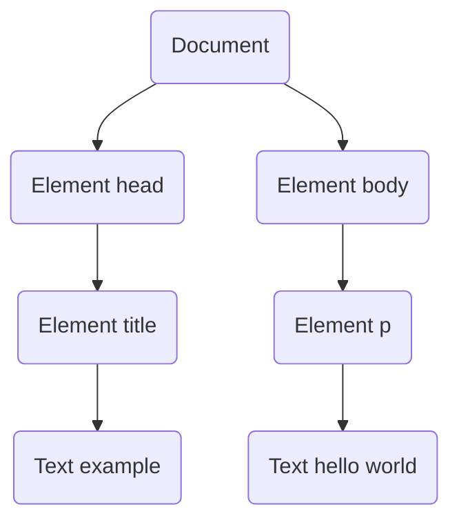
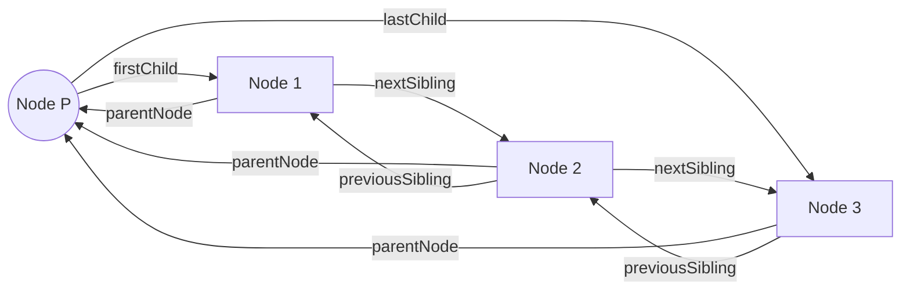

# JavaScript-basic

## JavaScript 的实现

```text

----------------------------
|       JavaScript         |
| |----------------------| |
| | ECMAScript  DOM  BOM | |
| |----------------------| |
|                          |
----------------------------
```

ECMAScript 一种规范, JavaScript 实现该规范的语言

## ECMAScript

### script 加载顺序

```js
<script src="js/jquery.js"></script>
<!-- 和 -->
<script>
    console.log("hello world");
</script>
```

在不使用 `async` 和 `dfer` 属性的前提下, 会按照 html 文件标签的顺序加载, 如果放进 `<head>` 里就是先加载 `<script>` 再加载页面, 为了不阻塞页面, 一般放在 `<body>` 标签的最后面。

如果使用 `async`, 会在加载到 `<script>`标签时开始加载, 但不会阻塞后面的标签加载, 加载时间不确定, 不完全按照标签顺序加载。

如果使用 `defer`, 会按照标签顺序, 在加载完 `</html>` 标签后依序加载。

### 基本数据类型

- `undefined`表示值未定义；

  ```js
  let foo
  console.log(foo) //undefined
  console.log(bar) //undefined

  foo = null
  console.log(typeof foo) // object
  ```

- `boolean`表示值为布尔值；

  ```c
  // false
  null;
  undefined;
  0;
  '';
  ```

- `string`表示值为字符串；

  ```js
  // tag function

  function simpleTag(strings, aValExpression, bValExpression, sumExpression) {
    console.log(strings)
    console.log(aValExpression)
    console.log(bValExpression)
    console.log(sumExpression)
  }
  // 等价于 剩余操作符 rest operator
  function simpleTag(strings, ...expressions) {
    return (
      strings[0] +
      expressions
        .map((expression, index) => `${expression}${strings[index + 1]}`)
        .join('')
    )
  }
  let a = 6
  let b = 9
  simpleTag`${a}+${b}=${a + b}`
  // ["","+","=",""]
  // 6
  // 9
  // 15
  ```

- `number`表示值为数值；

  ```js
  let a = 0b10 // 二进制 0b 开头
  let b = 070 // 八进制 0 开头
  let c = 0x36 // 十六进制 0x 开头

  // 浮点数
  0.1 + 0.2 != 0.3 //0.300000000000004

  if (Math.abs(0.1 + 0.2 - 0.3) < 0.00001);

  // NaN
  NaN == NaN // false

  isNaN() // 判断变量或者表达式是否是 NaN, 或者变量能否转换为 number

  // Infinity

  console.log(5 / 0) // Infinity
  console.log(0 / 0) // NaN

  isFinite() // 判断变量是否有限

  // 数值转换

  Number()
  // null -> 0 undefined-> NaN

  parseInt()
  parseInt('1234blue') // 1234
  parseInt('') // NaN

  parseFloat()
  parseFloat('1234blue') // 1234
  parseFloat('22.34.5') // 22.34
  ```

- `object`表示值为对象（而不是函数）或 null；
- `function`表示值为函数；
- `symbol`表示值为符号。唯一 类似 uuid

### 基本类型引用

```js
let name1 = 'Nicholas'
let name2 = new String('Matt')

name1.age = 10
name2.age = 20

console.log(name1.age) // undefined
console.log(name2.name) // 20

console.log(typeof name1) // string
console.log(typeof name2) // object

name1 instanceof String // false
name2 instanceof String // true
```

### 垃圾回收

#### 标记清理

变量进入执行上下文时会被标记一个声明, 变量离开上下文时则打上离开的标记, 浏览器会定时回收被打赏离开标记的变量。

#### 引用计数

记录变量被引用的次数, 被赋值+1, 取消赋值或被覆盖则-1, 成 0 的变量就是可清理变量。不过这种方式有很多问题, 例如循环引用, A 引用了 B, B 引用了 A, 就算 AB 都离开执行上下文, 因为互相引用, 也不会被清理, 这种方式已经被弃用了

#### 性能

- 使用 `const` 和 `let`
- 隐藏类: 如果两个变量同属一个引用类型(或者说类), 引擎会通过隐藏类将创建的对象关联起来, 提高性能。但要注意, 如果给其中一个变量动态删除属性与动态添加属性, 则两个变量对应不同的隐藏类。

  ```js
  // 避免 JavaScript 的“先创建再补充”（ready-fire-aim）式的动态属性赋值
  function Article() {
    this.title = ''
  }
  let a1 = new Article()
  let a2 = new Article()
  a2.author = 'Jake' // 动态添加

  // 修改, 在构造函数中一次性声明所有属性

  function Article(opt_author) {
    this.title = ''
    this.author = opt_author
  }
  let a1 = new Article()
  let a2 = new Article('Jake')

  //////////////////////////////////

  function Article() {
    this.title = ''
    this.author = 'Jake'
  }
  let a1 = new Article()
  let a2 = new Article()
  delete a1.author // 动态删除

  // 修改, 把不需要的属性设置为null

  function Article() {
    this.title = ''
    this.author = 'Jake'
  }
  let a1 = new Article()
  let a2 = new Article()
  a1.author = null
  ```

- 内存泄露

  ```js
  // 意外声明全局变量
  function setName() {
    name = 'Jake'
  }
  // 定时器

  let name = 'Jake'
  setInterval(() => {
    console.log(name)
  }, 100) // 定时器一直运行, 回调函数中引用的 name 就会一直占据内存

  // 闭包

  let outer = function () {
    let name = 'Jake'
    return function () {
      return name // name 内存泄露
    }
  }
  ```

- 对象池
- 静态分配 由于 JavaScript 数组的大小是动态可变的, 引擎会删除大小为 100 的数组, 再创建一个新的大小为 200 的数组。避免这种动态分配操作, 可以在初始化时就创建一个大小够用的数组, 从而避免上述先删除再创建的操作。静态分配是优化的一种极端形式。如果你的应用程序被垃圾回收严重地拖了后腿, 可以利用它提升性能。但这种情况并不多见。大多数情况下, 这都属于过早优化, 因此不用考虑。

### 基本引用类型

#### Date

```js
let date1 = new Date(2019, 0, 1) // 2019/01/01
let date2 = new Date(2019, 1, 1) // 2019/02/01
```

#### RegExp

```js
let expression = /pattern/flag;
let expression = new RegExp("pattern","flag")

// flag

// g 全局模式, 查找全部

// i 不区分大小写

// m 多行模式
// 若存在换行\n并且有开始^或结束$符的情况下, 和g一起使用实现全局匹配
// 因为存在换行时默认会把换行符作为一个字符任务匹配字符串是个单行
// g只匹配第一行, 添加m之后实现多行, 每个换行符之后就是开始

// s dotAll模式, 正常情况下 . 匹配除了 \n 以外的任意字符, s匹配所有字符

// y 每次调用exec()就只会在lastIndex的位置上寻找匹配项。粘附标记覆盖全局标记

let text="this has been a short summer"
let pattern=/(.)hort/g

if(pattern.test(text)){
  console.log(RegExp.input)
  console.log(RegExp.$_)      // this has been a short summer

  console.log(RegExp.leftContext)
  console.log(RegExp["$`"])   // this has been a

  console.log(RegExp.rightContext)
  console.log(RegExp["$'"])   //  summer

  console.log(RegExp.lastMatch)
  console.log(RegExp["$&"])   // short

  console.log(RegExp.lastParen)
  console.log(RegExp["$+"])   // s

}

let pattern2=/(..)or(.)/g

if(pattern2.test(text)){
  console.log(RegExp.$1)    // sh
  console.log(RegExp.$2)    // t
}
```

#### String

```js
let str = '你好,world'
console.log(str.length) // 8
console.loa(str.charAt(2)) // ,

let str1 = 'hello '
let str2 = 'world'
str1.concat(str2, '!') // hello world!

let str3 = 'hello world'

console.log(str3.slice(3)) // lo world
console.log(str3.substring(3)) // lo world
console.log(str3.substr(3)) // lo world

console.log([...'ab笑de']) // [ "a", "b", "笑", "d", "e" ]s

let msg = 'foobarbaz'
msg.startsWith('foo') // true
msg.startsWith('foo', 2) // false, 从第3个字符开始搜索
msg.startsWith('bad') // false
msg.endsWith('baz') // true
msg.endsWith('bar') // false
msg.includes('bar') // true
msg.includes('bar', 4) // false
msg.includes('qux') // false

msg = '  hello world  '
msg.trim() // hello world

toLowerCase() //转换为小写
toUpperCase() //转换为大写
```

#### Number

```js
let num = 10
num.toFixed(2) //10.00

num.toExponential(1) // 1.0e+1

let num = 99
num.toPrecision(1) // 1e+2
num.toPrecision(2) // 99
num.toPrecision(3) // 99.0
```

### 单例内置对象

#### Global

- `encodeURIComponent`：编码
- `decodeURIComponent`：解码
- `eval`：解释器

```js
var x = 10
var code = 'console.log(x + 5);'
eval(code) // 15
```

#### Window

参考[BOM](#window-1)

#### Math

- `min`：返回最小值
- `max`：返回最大值
- `ceil`：向上取整
- `floor`：向下取整
- `round`：四舍五入
- `random`：随机数
- `abs`：绝对值

### 合集应用类型

#### Array

```js
let arr = [1, 2, 3]
let arr = new Array(1, 2, 3)
let arr = Array(1, 2, 3)

Array.from() // 类数组 1,2,3 | '123' 转化成数组实例
Array.of() // 把一组参数转换为数组

// 数组空位
let array = [,] // [null, null]
array[0] // undefined

// 迭代器方法
let a = ['red', 'yellow']
a.keys() // 0, 1
a.values() // 'red', 'yellow'
a.entries() // [0,'red'], [1,'yellow']

// 复制填充方法
fill()
copyWithin()

// 栈、队列方法

push() // 最后插入
pop() // 最后弹出
shift() // 最前弹出
unshift() // 最前插入

// 排序
reverse() // 翻转

sort((a, b) => {
  // 从小到大, 也可加入比较函数
  return 1 // a,b
  return -1 // b,a
  return 0 // a = b
})

// 操作方法
let num = [0, 1, 2, 3]
num.concat(5, [6, 7]) // [0 ,1, 2, 3, 5, 6, 7]
num.slice(1) // [1, 2, 3]
num.slice(1, 4) // [1, 2, 3]

// 搜索
indexOf()
lastIndexOf()
find() // 第一个
findIndex() // 第一个

// 迭代方法
arr.every((currentValue) => currentValue < 40) // true/false
arr.some((currentValue) => currentValue < 40) // true/false
forEach((word) => word.length > 6) // ["abcdef","1234567"] 修改原数组
map((x) => x * 2) // 得到新数组并返回
filter()

// 归并方法
const arr = [1, 2, 3, 4]
const initialValue = 0
const sumWithInitial = arr.reduce(
  (accumulator, cur) => accumulator + cur,
  initialValue
)

reduceRight()
```

#### 定型数组 typed array

// todo

#### Map

```js
let map = new Map()
let m1 = new Map([
  ['key1', 'val1'],
  ['key2', 'val2'],
  ['key3', 'val3'],
])
let m2 = new Map([[]])

map.size

map.set('key1', 'value1').set('key2', 'value2')
map.get('key')
map.has('key')
map.delete('key')
map.clear()

for (let i of map.entries()) console.log(i) // 输出数组 ['a',1] ['b',2]
for (let i of map.keys()) console.log(i)
for (let i of map.values()) console.log(i)

map.forEach((value, key) => {})

// WeakMap 弱映射类
// 1. 弱映射中的 key 只能是 Object 或者继承自 Object 的类型,
//    尝试使用非对象设置键会抛出 TypeError。

let wm = new WeakMap()
wm.set({ id: 1 }, 'val1')
wm.set({}, 'val2')
// 2. 因为没有指向这个对象的其他引用
//    所以当这行代码执行完成后, 这个 {} 键 就会被当作垃圾回收。
// 3. 不可迭代
```

#### Set

```js
const set = new Set()

set.add('value1').add('value2')

set.size

set.has('value')
set.delete('value')
set.clear()

// WeakSet 弱合集
// 特性同WeakMap
```

### 迭代器与生成器

#### 迭代器模式

实现了正式的 Iterable 接口, 而且可以通过迭代器 Iterator 消费

```js
// 迭代器

let arr = ['foo', 'bar']
let iter = [Symbol.iterator]()
console.log(iter.next()) // {done: false, value: 'foo'}
console.log(iter.next()) // {done: true, value: 'bar'}

// 自定义迭代器, 通过 Symbol.iterator 方法创建

class Foo {
  [Symbol.iterator]() {
    return {
      next() {
        return { done: false, value: 'foo' }
      },
    }
  }
}
let foo = new Foo()
console.log(foo[Symbol.iterator]().next()) // {done: false, value: 'foo'}

// 提前终止迭代器

return()  // todo
```

#### 生成器

生成器是 ECMAScript 6 新增的一个极为灵活的结构, 拥有在一个函数块内暂停和恢复代码执行的能力。生成器的形式是一个函数, 函数名称前面加一个星号（＊）表示它是一个生成器。

**箭头函数**不能用来定义生成器函数

#### 通过 yield 中断执行

// todo

### 对象和类

#### 对象

创建 Object 实例

`let person = new Object()`,

添加属性和方法

`person.name = "Nicholas"`

`person.sayName = function() { console.log(this.name)}`

或者对象字面量

```js
let person = {
  name: 'Nicholas',
  sayName() {
    console.log(this.name)
  },
}
```

使用内部特性来描述属性的特征。

`[[属性内部特性]]`

数据属性

- `[[Configurable]]` : 是否可以被删除, 默认 true
- `[[Enumerable]]` : 是否可以被 for...in 遍历循环, 默认为 true
- `[[Writable]]` : 是否可以被赋值, 默认 true
- `[[Value]]` : 属性的值, 默认 undefined

`Object.defineProperty()` 修改属性默认特性

```js
let person = {}
Object.defineProperty(person, 'name', {
  writable: false,
  value: 'Nicholas',
})
```

访问器属性

- `[[Configurable]]` 是否可以删除
- `[[Enumerable]]` 是否可以通过 for...in 循环返回
- `[[Get]]` 获取函数, 在读取属性时调用。默认值为 undefined
- `[[Set]]` 设置函数, 在写入属性时调用。默认值为 undefined

```js
let book = {
  year_: 2017, // year_ 中的下划线常用来表示该属性并不希望在对象方法的外部被访问
  edition: 1,
}
Object.defineProperty(book, 'year', {
  get() {
    return this.year_
  },
  set(newVal) {
    if (newVal > 2017) {
      this.year_ = newVal
      this.edition += newVal - 2017
    }
  },
})
book.year = 2018 // year, 不是 year_
console.log(book.edition) // 2
```

`Object.defineProperties()` 同时定义多个属性

`Object.getOwnPropertyDescriptor()` 方法可以取得指定属性的属性描述符。

`Object.getOwnPropertyDescriptors()`

`Object.assign()` 方法, 将源对象的所有可枚举自身属性, 复制到目标对象。

`Object.is()` 方法, 判断两个值是否相等。对于-0, +0, isNaN 也能正确返回。
属性简写

```js
let name = 'Matt'
let person = {
  name,
}
consol.log(person) //{ name: 'Matt' }
```

对象结构

```js
let person = {
  name: 'Matt',
  age: 27,
}

let { name: personName, age: personAge } = person
let { name, age } = person

let { name, job } = person
console.log(personName) // Matt
console.log(age) // 27
console.log(job) // undefined

function printPerson(foo, { name, age }, bar) {
  console.log(name, age) // 'Matt', 27
}
```

工厂模式

```js
function createPerson(name, age, job) {
  let o = new Object()
  o.name = name
  o.age = age
  o.job = job
  o.sayName = function {
    console.log(this.name)
  }
  return o
}
```

构造函数模式

```js
function Person(){
  this.name = name
  this.age = age
  this.job = job
  this.sayName = function {
    console.log(this.name)
  }
}

let person = new Person('Greg', 18, 'Doctor')
```

要创建 `Person` 的实例, 应使用 `new` 操作符。以这种方式调用构造函数会执行如下操作。

1. 在内存中创建一个新对象
2. 这个新对象内部的 `[[Prototype]]`特性被赋值为构造函数的 **`prototype` 原型属性**
3. 构造函数内部的 this 被赋值为这个新对象（即 this 指向新对象）
4. 执行构造函数内部的代码（给新对象添加属性）
5. 如果构造函数返回非空对象, 则返回该对象；否则, 返回刚创建的新对象。

原型模式

每个函数都会创建一个 prototype 属性, 这个属性是一个**对象**, 包含应该由特定引用类型的实例共享的属性（如数组）和方法。

```js
function Person() {}
Person.prototype.name = 'Nicholas'
Person.prototype.age = 29
Person.prototype.sayName = function () {
  console.log(this.name)
}

function Person() {}
Person.prototype = {
  name: 'Nicholas',
  age: 29,
  sayName() {
    console.log(this.name)
  },
}
```

- 理解原型

  无论何时, 只要创建一个函数, 就会按照特定的规则为这个函数创建一个 prototype 属性（指向原型对象）。所有原型对象自动获得一个名为 constructor 的属性, 指回与之关联的构造函数, 其他的所有方法都继承自 Object。每次调用构造函数创建一个新实例, 这个实例的内部 `[[Prototype]]` 指针就会被赋值为构造函数的原型对象。**实例与构造函数原型之间有直接的联系, 但实例与构造函数之间没有。**

  // todo
  构造函数 -> 创建 prototype -> 创建 constructor

  实例 `__proto__` -> 原型对象（同一个）-> 构造函数（同一个）

- 判断原型

  `instanceof` 判断构造函数的 prototype 是否出现在对象的原型链上

  `Person.prototype.isPrototypeOf(person1)` 判断原型对象是否出现在实例对象的原型链上

  `Object.getPrototypeOf()` 返回对象的 `__proto__`属性

- 原型层级

  只要给对象实例添加一个属性, 这个属性就会遮蔽（shadow）原型对象上的同名属性, 也就是虽然不会修改它, 但会屏蔽对它的访问

  使用 `delete`操作符可以完全删除实例上的这个属性, 从而让标识符解析过程能够继续搜索原型对象。

- 原型和 `in`操作符

  `Object.hasOwnProperty()` 可以判断**实例**对象上有没有某个属性, `in` 操作符可以判断通过该对象是否能访问到某个属性（实例和原型对象）。

  这两个结合可以判断实例对象的原型链上是否存在某个属性：`object.hasOwnProperty(name) == false && name in object == true`

  `Object.keys()` 只会返回实例对象上的可枚举属性, `Object.getOwnPropertyNames()` 可以返回所有实例属性, 包括不可枚举属性。

对象迭代

`Object.values()` 和 `Object.entries()` 接收一个对象, 返回它们内容的数组。`Object.values()` 返回对象值的数组, `Object.entries()` 返回键/值对的数组。

#### 继承

// todo

#### 类

```js
// 类声明
class Person{}
// 类表达式
class Animal = class{}

class Foo{
  constructor(){}
  set name(name){this,name_ = name}
  get name(){return this.name_} // 获取函数
  static mySolution(){} // 静态方法
}
```

// todo

### 代理和反射

`const proxy = new Proxy(target, handler)`

`target` 目标对象, `handler` 处理函数

在代理对象上执行的任何操作实际上都会应用到目标对象。

`Proxy.prototype` 是 `undefined`, 不能使用 `instanceof`

`trap` 捕获器

```js
const target = {
  foo: 'bar',
  baz: 'qux'
}

const handler = {
  get(){
    return 'handle override'
  }
  // 使用
  get(trapTarget, property, receiver){
    let decoration = '';
    if(property == 'foo'){
      decoration ='!!!'
    }
    return Reflect.get(...arguments) + decoration
  }
}

const proxy = new Proxy(target, handle)
// revoke 撤销函数
const {proxy, revoke} = Proxy.revocable(target, handle)
// 只有在代理对象上执行这些操作才会触发捕获器
console.log(target.foo) // bar
console.log(proxy.foo) // handle override

console.log(target[foo]) // bar
console.log(proxy[foo]) // handle override
```

`proxy` 不能代理 `Date`

#### 代理模式

- 跟踪属性访问

```js
const user = {
  name: 'Jake',
}

const proxy = new Proxy(user, {
  get(target, property, receiver) {
    console.log(`Getting ${property}`)
    return Reflect.get(...arguments)
  },
  set(target, property, value, receiver) {
    console.log(`Setting ${property} = ${value}`)
    return Reflect.set(...arguments)
  },
})
```

- 隐藏属性

```js
const hiddenProperties = ['foo', 'bar']
const targetObject = {
  foo: 1,
  bar: 2,
  bax: 3,
}

const proxy = new Proxy(targetObject, {
  get(target, property) {
    if (hiddenProperties.includes(property)) return undefined
    else return Reflect.get(...arguments)
  },
  has(target, property) {
    if (hiddenProperties.includes(property)) return false
    else return Reflect.has(...arguments)
  },
})
```

- 验证属性

  `set()`时, 根据所赋的值决定是允许还是拒接赋值

- 函数与构造函数参数验证

  ```js
  //  让函数只接受某种类型的值
  function median(...nums) {
    return nums.sort()[Math.floor(nums.length / 2)]
  }

  const proxy = new Proxy(median, {
    apply(target, thisArg, argumentsList) {
      for (const arg of argumentsList) {
        if (typeof arg !== 'number') {
          throw 'Non-number argument provided'
        }
      }
      return Reflect.apply(...arguments)
    },
  })

  // 要求实例化时必须给构造函数传参

  class User {
    constructor(id) {
      this.id_ = id
    }
  }

  const proxy = new Proxy(User, {
    construct(target, argumentsList, newTarget) {
      if (argumentsList[0] === undefined) {
        throw 'User cannot be instantiated without id'
      } else {
        return Reflect.construct(...arguments)
      }
    },
  })
  ```

- 数据绑定与可观察对象

```js
const userList = []
class User {
  constructor(name) {
    this.name_ = name
  }
}
const proxy = new Proxy(User, {
  construct() {
    const newUser = Reflect.construct(...arguments)
    userList.push(newUser)
    return newUser
  },
})
```

### 函数

函数是一个对象

`this` 箭头函数中的 `this` 会保留定义该环境时的上下文

```js
function King() {
  this.royaltyName = 'Henry'
  setTimeout(() => console.log(this.royaltyName)) // Henry
  setTimeout(function () {
    console.log(this.royaltyName)
  }) // undefined, this 引用 window 对象
}

// bind() 会返回一个新的实例, 该实例的 this 指向 bind 的参数
const module = {
  x: 42,
  getX: function () {
    return this.x
  },
}
const unboundGetX = module.getX
console.log(unboundGetX())

const boundGetX = unboundGetX.bind(module)
console.log(boundGetX())
```

#### 尾调优化

```js
// 有优化
function f(a, b) {
  return h(a + b)
}
// 有优化, 初始返回值不涉及栈帧
function f(a, b) {
  if (a < b) {
    return a
  }
  return h(a + b)
}
//有优化, 两个内部函数都在尾部
function f(condition) {
  return condition ? h() : g()
}

function fib(n) {
  if (n < 2) return n
  return fib(n - 1) + fib(n - 2) // 无优化, 返回语句中有相加操作
}
// 修改成下面形式
function fib(n) {
  return fibImpl(0, 1, n)
}

function fibImpl(a, b, n) {
  if (n === 0) return a
  return fibImpl(b, a + b, n - 1)
}
```

#### 闭包 closure

```js
// 匿名函数调用 propertyName 导致 f 函数结束无法直接回收 propertyName
function f(propertyName) {
  return function (o1, o2) {
    let val1 = o1[propertyName]
    let val2 = o2[propertyName]
    return val1 - val2
  }
}
```

#### 立即调用的函数表达式 IIFE

```js
;(function () {
  // 块级作用域
})()

// 单例模式
let timeTool = (function () {
  let _instance = null

  function init() {
    //私有变量
    let now = new Date()
    //公用属性和方法
    ;(this.name = 'time tool'),
      (this.getISODate = function () {
        return now.toISOString()
      })
    this.getUTCDate = function () {
      return now.toUTCString()
    }
  }

  return function () {
    if (!_instance) {
      _instance = new init()
    }
    return _instance
  }
})()
```

### promise 与 异步函数

#### 同步与异步

同步行为 顺序执行

异步行为 系统中断

#### Promise

**Promise 状态**

- 待定 pending
- 兑现 fulfilled 解决 resolved
- 拒绝 rejected

`Promise.resolve()` 相当于 `new Promise(resolve => resolve())`

`Promise.reject()` 相当于 `new Promise((resolve, reject) => reject())`

`Promise.prototype.then(onResolved, onRejected)` 返回一个新的 `Promise` 实例, 新实例默认通过 `Promise.resolve()` 包装, 无返回值则为 `undefined`

`Promise.prototype.catch(onRejected)` 相当于 `Promise.prototype.then(null, onRejected)`

`Promise.prototype.finally(onFinally)`

**非重入特性 non-reentrancy**

在一个解决期约上调用 then() 会把 onResolved 处理程序推进消息队列, 在当前线程上的同步代码执行完成后执行

**邻近处理程序的执行顺序**

先添加到队列的期约先执行, 后添加的期约后执行

**Promise 连锁**

`Promise.all([Promise.resolve(),Promise.reject()])`

合成的期约只会在每个包含的期约都解决之后才解决。如果有期约拒绝, 则第一个拒绝的期约会将自己的理由作为合成期约的拒绝理由。

`Promise.race()`

不会对解决或拒绝的期约区别对待。无论是解决还是拒绝, 只要是第一个落定的期约, `Promise.race()` 就会包装其解决值或拒绝理由并返回新期约。

**Promise 扩展**

// todo

#### 异步函数

```js
async function foo()
let bar = async function()
let baz = async () => {}
class Qux{
  async qux(){}
}
```

异步函数如果使用 return 关键字返回了值（如果没有 return 则会返回 undefined）, 这个值会被 Promise.resolve()包装成一个期约对象。

使用 async 关键字可以让函数具有异步特征, 但总体上其代码仍然是同步求值的。

异步函数如果不包含 await 关键字, 其执行基本上跟普通函数没有什么区别

avaScript 运行时在碰到 await 关键字时, 会记录在哪里暂停执行。等到 await 右边的值可用, 即同步部分运行完成, JavaScript 运行时会向消息队列中推送一个任务, 这个任务会恢复异步函数的执行。

```js
async function sleep(delay) {
  return new Promise((resolve) => {
    setTimeout(resolve, delay)
  })
}
```

## BOM(Browser Object Model) 浏览器对象模型

### window

top 对象始终指向最上层窗口, parent 指向当前窗口的父窗口, self 始终指向 window

```js
// 把窗口移动到 左上角
window.moveTo(0, 0)
// 窗口向左移动 50px, 向下移动 100px
window.moveBy(-50, 100)
```

`window.devicePixelRatio` : 物理像素与 CSS 像素之间的转换比率, 与每英寸像素数（DPI, dots per inch）对应

对于分辨率从 1920×1080 转换为 640×320 的设备, window.devicePixelRatio 的值就是 3

`innerWidth` 和 `innerHeight` 返回浏览器窗口中页面视口的大小（不包含浏览器边框和工具栏）, `outerWidth` 和 `outerHeight` 返回浏览器窗口自身的大小

```js
window.scrollTo({
  left: 100,
  top: 100,
  behavior: 'auto', // 正常滚动
  behavior: 'smooth', // 平滑滚动
})
```

弹窗 `window.open(url, target, string)` 跟 `<a href=url target=target>` 一样

### setTimeout

`timeoutId = setTimeout(functionRef, delay, [ param1, /*...,*/ paramN ])`

`intervalId = setInterval()` 用于指定每隔一段时间执行某些代码

`clearInterval()`,`clearTimeout()` 清除定时

所有超时执行函数的 this 都指向 window, 如果需要调用它的函数的 this, 可以用箭头函数。

### 系统对话框

`alert()` `confirm()` `prompt()` `find()` `print()`

### location

- 查询字符串
  `document.location.search` 保存了从 `?` 开始直到 URL 末尾的所有内容

  ```js
  let qs = '? q=hello%20world&num=10'
  let str = new URLSearchParams(qs) //" q=hello world&num=10"
  searchParams.has('num') // true
  searchParams.get('num') // 10
  searchParams.set('page', '3')
  alert(searchParams.toString()) // " q=hello world&num=10&page=3"
  searchParams.delete('q')
  alert(searchParams.toString()) // " num=10&page=3"
  ```

- 操作地址
  `location.assign(url)` 这行代码会立即启动导航到新 URL 的操作, 同时在浏览器历史记录中增加一条记录。

  如果给 `location.href` 或 `window.location` 设置一个 URL, 也会以同一个 URL 值调用 `assign()` 方法

  ```js
  // 假设当前URL为http://www.wrox.com/WileyCDA/
  // 把URL修改为http://www.wrox.com/WileyCDA/#section1
  location.hash = '#section1'
  // 把URL修改为http://www.wrox.com/WileyCDA/?q=javascript
  location.search = '? q=javascript'
  // 把URL修改为http://www.somewhere.com/WileyCDA/
  location.hostname = 'www.somewhere.com'
  // 把URL修改为http://www.somewhere.com/mydir/
  location.pathname = 'mydir'
  // 把URL修改为http://www.somewhere.com:8080/WileyCDA/
  location.port = 8080
  ```

  除了 `hash` 之外, 只要修改 `location` 的一个属性, 就会导致页面重新加载新 URL, 修改 `hash` 只会添加一条历史记录

  `location.replace(url)` 这个方法接收一个 URL 参数, 但重新加载后不会增加历史记录。调用 `replace()`之后, 用户不能回到前一页

  `location.reload()` 它能重新加载当前显示的页面

  ```js
  location.reload() // 重新加载, 可能是从缓存加载
  location.reload(true) // 重新加载, 从服务器加载
  ```

### navigator

navigator 对象的属性通常用于确定浏览器的类型

- navigator.plugins 数组

```js
;[
  // 每一项
  {
    name: '插件名称',
    description: '插件介绍',
    filename: '插件的文件名',
    length: '由当前插件处理的MIME类型数量',
  },
]
```

- registerProtocolHandler()

  这个方法可以把一个网站注册为处理某种特定类型信息应用程序

  传入 3 个参数：要处理的协议（如"mailto"或"ftp"）、处理该协议的 URL, 以及应用名称

### screen

这个对象中保存的纯粹是客户端能力信息, 也就是浏览器窗口外面的客户端显示器的信息, 比如像素宽度和像素高度。

### history

- history.go()

  ```js
  // 后退一页
  history.go(-1)
  history.back()
  // 前进一页
  history.go(1)
  history.forward()
  // 前进两页
  history.go(2)
  // 判断是不是用户窗口中的第一个页面, 即确定用户浏览器的起点是不是你的页面
  // history对象还有一个length属性, 表示历史记录中有多个条目
  if (history.length == 1) {
  }
  ```

- 历史状态管理

  `hashchange` 事件：页面 URL 的散列变化时被触发

  `history.pushState()` 方法：接收 3 个参数：一个 state 对象、一个新状态的标题和一个（可选的）相对 URL

  `popstate` 事件（在 window 对象上）：后退时触发

  `history.state` 属性：当前的历史记录状态

  `history.replaceState()` 方法：接收与 `pushState()` 一样的前两个参数来更新状态

### 客户端检测

#### 能力检测

特性检测, 先检测最优方法, 再检测备用方案, 实在不行再抛错

#### 安全能力检测

进行能力检测时应该尽量使用 typeof 操作符

#### 基于能力检测进行浏览器分析

如果你的应用程序需要使用特定的浏览器能力, 那么最好集中检测所有能力, 而不是等到用的时候再重复检测

### 用户代理检测

用户代理检测通过浏览器的用户代理字符串确定使用的是什么浏览器

|                   变量名                   | 含义                                                                                                                            |
| :----------------------------------------: | :------------------------------------------------------------------------------------------------------------------------------ |
|           `navigator.userAgent`            | 用户代理检测通过浏览器的用户代理字符串确定使用的是什么浏览器                                                                    |
|             `navigator.oscpu`              | 对应用户代理字符串中操作系统/系统架构相关信息                                                                                   |
|             `navigator.vendor`             | 包含浏览器开发商消息                                                                                                            |
| `screen.colorDepth` 和 `screen.pixelDepth` | 显示器每像素颜色的位深                                                                                                          |
|            `screen.orientation`            | 返回一个 ScreenOrientation 对象, 其中包含 Screen Orientation API 定义的屏幕信息, orientation.type 和 angle 可以确定屏幕旋转信息 |
|          `navigator.geolocation`           | 暴露了 Geolocation API, 可以让浏览器脚本感知当前设备的地理位置                                                                  |
|            `navigator. onLine`             | 确定浏览器的联网状态。连网和断网会触发 window 的 online 和 offline 事件。                                                       |
|           `navigator.connection`           | 网络连接状况                                                                                                                    |
|          `navigator.getBattery()`          | 暴露了 Battery API, 可以让浏览器脚本感知当前设备的电池状态                                                                      |
|      `navigator.hardwareConcurrency`       | 返回浏览器支持的逻辑处理器核心数量                                                                                              |
|          `navigator.deviceMemory`          | 返回设备大致的系统内存大小                                                                                                      |
|         `navigator.maxTouchPoints`         | 返回触摸屏支持的最大关联触点数量                                                                                                |

## DOM(Document Object Model) 文件对象模型

API(Application Programming Interface, 应用程序编程接口) 是一些预先定义的函数

- 文档: document
- 元素: element (标签)
- 节点: node (标签、属性、文本、注释等)



### Document

document 是 HTMLDocument 的实例（HTMLDocument 继承 Document）

Document 类型节点：

- nodeType = 9
- nodeName = "#document"
- nodeValue = null
- parentNode = null
- ownerDocument = null
- 子节点可以是以下类型：
  - DocumentType（最多一个）
  - Element（最多一个）
  - ProcessingInstruction
  - Comment

| 属性/方法                  | 描述                                       |
| -------------------------- | :----------------------------------------- |
| `document.documentElement` | `<html>`                                   |
| `document.body`            | `<body>`                                   |
| `document.head`            | `<head>`                                   |
| `document.doctype`         | 返回文档的 doctype, 即 `<!DOCTYPE>` 标签。 |
| `document.title`           | 当前页面的标题, 可修改。                   |
| `document.URL`             | 当前页面的 URL。                           |
| `document.domain`          | 域名, 只能设置当前 URL 包含的域名。        |
| `document.anchors`         | 包含文档中所有带 name 属性的 `<a>` 元素。  |
| `document.forms`           | `document.getElementsByTagName("form")`    |
| `document.images`          | `document.getElementsByTagName("img")`     |
| `document.links`           | 包含文档中所有带 href 属性的 `<a>` 元素。  |

### Element

- `nodeType` 等于 1
- `nodeName` 值为元素的标签名
- `nodeValue` 值为 null
- `parentNode` 值为 Document 或 Element 对象
- 子节点可以是以下类型：
  - Element
  - Text
  - Comment
  - ProcessingInstruction
  - CDATASection
  - EntityReference

| 属性        | 描述                                                                   |
| ----------- | ---------------------------------------------------------------------- |
| `id`        | 元素在文档中的唯一标识符；                                             |
| `title`     | 包含元素的额外信息, 通常以提示条形式展示；                             |
| `lang`      | 元素内容的语言代码（很少用）；                                         |
| `dir`       | 语言的书写方向（"ltr" 表示从左到右, "rtl" 表示从右到左, 同样很少用）； |
| `className` | 相当于 class 属性, 用于指定元素的 CSS 类。                             |

### Node

Document, Element, Attr 继承 Node

#### 节点类型

| nodeType (常量)     | 值  | 描述                                |
| ------------------- | --- | ----------------------------------- |
| Node.ELEMENT_NODE   | 1   | 一个元素节点, 例如 `<p>` 和 `<div>` |
| Node.ATTRIBUTE_NODE | 2   | 属性节点                            |
| Node.TEXT_NODE      | 3   | Element 或者 Attr 中实际的 文字     |

#### 子节点

`parentNode.childNodes` 包含指定 **节点的子节点的集合**, 该集合为即时更新的集合, 如 `[text,div,text,p,text]`

`parentNode.children` 返回子标签, 如 `[div,p]`

- 获取所有结点中的第一个和最后一个：
  `parentNode.firstChild`
  `parentNode.lastChild`
- 获取元素节点中第一个和最后一个
  `parentNode.firstElementChild`
  `parentNode.lastElementChild`

#### 兄弟节点

- 返回下一个兄弟节点：
  `node.nextSibling`
- 返回上一个的兄弟节点
  `node.previousSibling`
- 返回下一个 兄弟元素节点
  `node.nextElementSibling`
- 返回上一个 兄弟元素节点
  `node.previousElementSibling`



#### 添加节点

`Node.createElement("tagName")`

`Node.appendChild()`

`var insertedNode = parentNode.insertBefore(newNode, referenceNode)`

- `insertedNode` 被插入节点 (newNode)
- `parentNode` 新插入节点的父节点
- `newNode` 用于插入的节点
- `referenceNode` newNode 将要插在这个节点之前

如果 referenceNode 为 null 则 newNode 将被插入到子节点的末尾

### 获取元素

#### 获取元素对象

```js
// 打印返回的元素对象
console.dir()
```

- id 获取 `element.getElementById('id')`
- 标签名获取元素对象集合, 以**伪数组**的形式存储, 可以传入 `*`, 返回所有元素 `element.getElementsByTagName('div')`
- class name 获取元素对象集合, 以**伪数组**的形式存储 `element.getElementsByClassName('class')`
- 选择任一单个 `element.querySelector(' .class | #id | element | element.class')` 返回指定选择器的**第一个元素对象**
- 选择所有 `element.querySelectorAll(' .class | #id | element | element.class')` 获取元素对象集合, 以**伪数组**的形式存储
- `element.matched("css选择符参数")` 判断该 element 是否匹配该选择符

#### 获取属性对象

- 兼容性获取 `element.getAttribute('attribute')`
  - `style DOM` 对象返回一个 CSSStyleDeclaration 对象, getAttribute()只返回字符串。
  - `onclick DOM` 对象返回一个函数, getAttribute() 返回源码, setAttribute(name,value)
- `element.dataset.index` 或 `element.dataset['index']` 获取。`element.dataset.index` 和 `element.dataset['index']` 方法, 注意 `index` 和 `data-index` 中的要对应。

### 操作元素

#### 修改元素内容

`element.innerText` 从起始位置到终止位置的内容, 但它去除 html 标签, 同时空格和换行也会去掉

`element.innerHTML` 识别 HTML 标签, 保留换行空格格式

```js
// 在 div 中插入
div.innerHTML = '<p>Hell & welcome, <b>"reader"!</b></p>'
// 取代原来的 div
div.outerHTML = '<p>Hello & welcome, <b>"reader"! </b></p>'
```

#### 修改元素属性

```js
// 普通元素
var btn1 = document.getElementById('btn1')
var btn2 = document.getElementById('btn2')
var img = document.getElementById('img')

btn1.onclick = () => {
  img.src = 'images/img1.jpg'
}

btn2.onclick = () => {
  img.src = 'images/img2.jpg'
}

// 表单元素

// type value='' checked selected disabled=true
btn.onclick = () => {
  this.disabled = true // 禁用 button
}

// 设置元素属性

element.attribute = 'value' // 设置内置属性值。
element.setAttribute('attribute', 'value') // 设置自定义属性。
// 对于 element.setAttribute 方法, 若属已存在, 则更新该属性值；否则, 创建一个新属性。

// 移除属性
element.removeAttribute('attribute')
```

#### 修改元素样式元素

```js
var div = document.querySelector('div')

// className
// 负责完全删除或重写
div.onclick = () => {
  // element.style : 行内样式
  // js 里面的样式采取驼峰命名法比如 fontSize、backgroundColor
  this.style.backgroundColor = 'blue'

  // element.className : 类名样式
  // className 会直接更改元素的类名, 会覆盖原先的类名
  this.className = 'changed'
  // 表留原先类名
  this.className = 'origin changed'
}

// classList
// 负责 curd
// 删除 "disabled" 类
div.classList.remove('disabled')
// 添加 "current" 类
div.classList.add('current')
// 切换 "user" 类, 有则添加, 无则删除
div.classList.toggle('user')
```

### MutationObserver

在 DOM 被修改时异步执行回调

```js
// callback 传入回调函数
let observer = new MutationObserver(()=>console.log('DOM was mutated'))

// 观察器的配置（需要观察什么变动）
const config = { attributes: true, childList: true, subtree: true };
// observer 节点 配置
let observer.observe(document.body, {attributes:true})
document.body.className = 'foo'
console.log('Changed body class')
// Changed body class
// <body> attributes changed
// 回调函数在console.log()后执行

// 每个回调都会收到一个 MutationRecord 实例的数组

observer.disconnect() // 停止观察


```

### HTML5 扩展

- `document.activeElement` 始终包含当前拥有焦点的 DOM 元素, 确定哪个元素拥有焦点
- `document.hasFocus()` 返回布尔值, 查询文档是否获得了焦点
- `document.readyState` 文档正在加载 `loading`, 文档加载完成 `complete`
- `document.compatMode` 检测页面渲染模式 `CSS1Compat` 标准模式, `BackCompat` 混杂模式
- `document.characterSet = "UTF-8"`
- `scrollIntoView()` 可以滚动浏览器窗口或容器元素以便包含元素进入视口 [`window.scrollTo`](#window-1)

## 事件

1. 获取事件源
   `var div = document.getElementById('id')`
2. 注册事件（绑定事件）
   `div.onclick()`
3. 添加事件处理程序（函数赋值）
   `div.onclick = function(){ // 处理代码 }`

### 事件流

事件流描述了页面接收事件的顺序

#### DOM 事件流

DOM2 Events 规范规定事件流分为 3 个阶段：事件捕获、到达目标和事件冒泡

事件捕获->提前拦截事件
到达目标->接收事件
事件冒泡->响应事件

### 事件处理程序

为响应事件而调用的函数被称为事件处理程序（或事件监听器）

#### HTML 事件处理函数

```html
<input type="button" value="Click Me" onclick="console.log(this.value)" />

<script>
  // onclick 属性中的值能直接访问到 document 和 this 里面的值
  // 这种方式的事件处理程序会创建一个局部变量 event
  // 等价于
  function() {
    with(document) {
      with(this) {
        // 属性值
        console.log(this.value)
      }
    }
  }
</script>

<form>
  <input type="button" value="Click Me" onclick="console.log(this.value)" />
</form>

<script>
  // 如果这个元素是一个表单输入框, 则作用域链中还会包含表单元素
  function() {
    with(document) {
      with(this.form) {
        with(this) {

        }
      }
    }
  }
</script>
```

#### DMO0 时间处理程序

```js
let btn = document.getElementById('myBtn')
btn.onclick = function () {
  console.log(this.id) // myBtn
  console.log(btn === this) // this
}
// 事件移除
btn.onclick = null
```

#### DOM2 事件处理程序

`addEventListener()` 和 `removeEventListener()`

```js
let btn = document.getElementById('myBtn')
btn.addEventListener(
  'click',
  function () {
    console.log(this.id) // myBtn
    console.log(btn === this) // true
  },
  false
) // true 为捕获阶段触发, false 非捕获阶段触发, 默认 false
```

### 事件对象

在 DOM 中发生事件时, 所有相关信息都会被收集并存储在一个名为 event 的对象中

#### DOM 事件对象

event 对象是传给事件处理程序的唯一参数

```js
let btn = document.getElementById('myBtn')
btn.onclick = function (event) {}
btn.addEventListener('click', (event) => {})
```

`event.type` 属性包含事件类型

`currentTarget` 的值等于 `this` 对象, `target` 只包含时间的实际目标(触发事件的元素), `event.target && event.target.id === "myButton"` 检测目标元素

`preventDefault()` 方法用于阻止特定事件的默认动作, 其事件对象的 `cancelable` 属性都会设置为 true

`stopPropagation()` 用于立即阻止事件流在 DOM 结构中传播, 取消后续的事件捕获或冒泡

`event.eventPhase` 可以确定事件流的状态：1 = 捕获阶段, 2 = 目标调用, 3 = 冒泡阶段。

event 对象只在事件处理程序执行期间存在, 一旦执行完毕, 就会被销毁。

### 事件类型

`addEventListener('事件类型', (event) => {})`

- 用户界面事件 `UIEvent`：涉及与 BOM 交互的通用浏览器事件
- 焦点事件 `FocusEvent`：在元素获得和失去焦点时触发
- 鼠标事件 `MouseEvent`：使用鼠标在页面上执行某些操作时触发
- 滚轮事件 `WheelEvent`：使用鼠标滚轮（或类似设备）时触发
- 输入事件 `InputEvent`：向文档中输入文本时触发
- 键盘事件 `KeyboardEvent`：使用键盘在页面上执行某些操作时触发
- 合成事件 `CompositionEvent`：在使用某种 IME（Input Method Editor, 输入法编辑器）输入字符时触发

#### UIEvent

|  事件名  | 描述                                                                                                                                                             |
| :------: | ---------------------------------------------------------------------------------------------------------------------------------------------------------------- |
|  `load`  | window 页面加载完成, frameset 所有 frame 都加载完成后, img 元素图片加载完成后, 在 object 元素相应对象加载完成后触发                                              |
| `unload` | window 上当页面完全卸载后触发, 在窗套上当所有窗格都卸载完成后触发, 在 object 元素上当相应对象卸载完成后触发。                                                    |
| `abort`  | object 元素上当相应对象加载完成前被用户提前终止下载时触发。                                                                                                      |
| `error`  | window 上当 JavaScript 报错时触发, 在 img 元素上当无法加载指定图片时触发, 在 object 元素上当无法加载相应对象时触发, 在窗套上当一个或多个窗格无法完成加载时触发。 |
| `select` | 在文本框（input 或 textarea）上当用户选择了一个或多个字符时触发。                                                                                                |
| `resize` | 在 windows 或窗格上当窗口或窗格被缩放时触发。                                                                                                                    |
| `scroll` | 当用户滚动包含滚动条的元素时在元素上触发。body 元素包含已加载页面的滚动条。                                                                                      |
| `unload` | 在文档卸载完成后触发, 可以给 body 添加一个 onunload 事件, 在页面卸载时执行一些操作。                                                                             |
| `resize` | 当浏览器窗口被缩放到新高度或宽度时, 会触发 resize 事件。                                                                                                         |

#### 焦点事件

|   事件名   | 描述                              |
| :--------: | --------------------------------- |
|   `blur`   | 失去焦点时触发,事件不冒泡         |
|  `focus `  | 获得焦点时触发,事件不冒泡         |
| `focusin`  | 获得焦点时触发,冒泡               |
| `focusout` | 元素失去焦点时触发（通用版）,冒泡 |

#### 鼠标和滚轮事件

|    事件名    | 描述                                                           |
| :----------: | -------------------------------------------------------------- |
|   `click`    | 在用户单击鼠标主键（通常是左键）或按键盘回车键时触发           |
|  `dblclick`  | 在用户双击鼠标主键（通常是左键）时触发。                       |
| `mousedown`  | 在用户按下任意鼠标键时触发, 不支持键盘触发。                   |
| `mouseenter` | 鼠标光标从元素外部移到内部时触发, 不冒泡, 不会在后代元素上触发 |
| `mouseleave` | 鼠标光标从元素内部移到外部时触发, 不冒泡, 不会在后代元素上触发 |
| `mousemove`  | 在鼠标光标在元素上移动时反复触发, 不支持键盘触发。             |
|  `mouseout`  | 鼠标光标从一个元素移到另一个元素上时触发, 不支持键盘触发。     |
| `mouseover`  | 鼠标光标从元素外部移到内部时触发, 不支持键盘触发。             |
|  `mouseup`   | 在用户释放鼠标键时触发, 不支持键盘触发。                       |
| `mousewheel` | 滚轮事件                                                       |

除了 mouseenter 和 mouseleave 外, 所有鼠标事件都冒泡, 都可取消

**鼠标坐标**

- 窗口坐标：event 对象的 clientX 和 clientY 属性中
- 页面坐标：通过 event 对象的 pageX 和 pageY 可以获取。在页面没有滚动时, pageX 和 pageY 与 clientX 和 clientY 的值相同。
- 屏幕坐标：event 对象的 screenX 和 screenY 属性获取鼠标光标在屏幕上的坐标。

**修饰键**

修饰键 Shift、Ctrl、Alt、Meta

布尔值 shiftKey、ctrlKey、altKey、metaKey 按下为 true

#### 键盘与输入事件

|   事件名    | 描述                                                                                                        |
| :---------: | ----------------------------------------------------------------------------------------------------------- |
|  `keydown`  | 在按键被按下时触发。                                                                                        |
| `keypress`  | 用户按下键盘上某个键并产生字符时触发, 而且持续按住会重复触发。Esc 键也会触发这个事件。推荐 textInput 事件。 |
|   `keyup`   | 用户释放键盘上某个键时触发                                                                                  |
| `textInput` | 输入事件 , 会在文本被插入到文本框之前触发, 在有新字符被插入时才会触发                                       |

`event.keycode` 键码 对于 keydown 和 keyup 事件, event 对象的 keyCode 属性中会保存一个键码, 对应键盘上特定的一个键。对于字母和数字键, keyCode 的值与小写字母和数字的 ASCII 编码一致

`event.charCode` 字符编码 只有发生 keypress 事件时这个属性才会被设置值, 包含的是按键字符对应的 ASCII 编码

`event.data` data 的值始终是要被插入的字符

#### 合成事件

用于检测和控制需要同时按下多个键才能输入一个字符的输入

|       事件名        | 描述                                                    |
| :-----------------: | ------------------------------------------------------- |
| `compositionstart ` | 在 IME 的文本合成系统打开时触发, 表示输入即将开始       |
| `compositionupdate` | 在新字符插入输入字段时触发                              |
|  `compositionend`   | 在 IME 的文本合成系统关闭时触发, 表示恢复正常键盘输入。 |

#### HTML5 事件

`contextmenu` 在鼠标右键点击时触发。可以 preventDefault() 来阻止默认行为.

```js
div.addEventListener('contextmenu', (event) => {
  event.preventDefault()
  let menu = document.getElementById('myMenu')
  menu.style.left = event.clientX + 'px'
  menu.style.top = event.clientY + 'px'
  menu.style.visibility = 'visible'
})
document.addEventListener('click', (event) => {
  document.getElementById('myMenu').style.visibility = 'hidden'
})
```

`beforeunload` 用意是给开发者提供阻止页面被卸载的机会。这个事件会在页面即将从浏览器中卸载（关闭）时触发, 如果页面需要继续使用, 则可以不被卸载。

```js
window.addEventListener('beforeunload', (event) => {
  let message = "I'm really going to miss you if you go."
  event.returnValue = message
  return message
})
```

`DOMContentLoaded` DOM 树构建完成后立即触发, 而不用等待图片、JavaScript 文件、CSS 文件或其他资源加载（window 的 load 事件中完成）完成。

`readystatechange` // todo

`pageshow` `pagehide` 往返缓存（bfcache, back-forward cache）, 把整个页面都保存在内存里, 旨在使用浏览器“前进”和“后退”按钮时加快页面之间的切换。`pageshow` 和 `pagehide` 的 event 对象中还包含一个名为 `persisted` 的属性。这个属性是一个布尔值, 如果页面存储在了往返缓存中就是 true, 否则就是 false。

`hashchange` 用于在 URL 散列值（URL 最后#后面的部分）发生变化时通知开发者。 event 对象有两个新属性：`oldURL` 和 `newURL`。这两个属性分别保存变化前后的 URL, 而且是包含散列值的完整 URL。

移动端的事件 // todo

### 内存与性能

JavaScript 中, 页面中事件处理程序的数量与页面整体性能直接相关。

- 每个函数都是对象, 都占用内存空间, 对象越多, 性能越差。
- 为指定事件处理程序所需访问 DOM 的次数会先期造成整个页面交互的延迟。

#### 事件委托

利用事件冒泡, 可以只使用一个事件处理程序来管理一种类型的事件。使用事件委托, 只要给所有元素共同的祖先节点添加一个事件处理程序, 就可以解决问题。

- document 对象随时可用, 任何时候都可以给它添加事件处理程序（不用等待 DOMContentLoaded 或 load 事件）。这意味着只要页面渲染出可点击的元素, 就可以无延迟地起作用。
- 节省花在设置页面事件处理程序上的时间。只指定一个事件处理程序既可以节省 DOM 引用, 也可以节省时间。
- 减少整个页面所需的内存, 提升整体性能。

#### 删除事件处理程序

及时删除不用的事件处理程序

- 删除带有事件处理程序的元素, removeChild()或 replaceChild()删除节点。innerHTML 需要手动删除程序。
- 在 onunload 事件处理程序中趁页面尚未卸载先删除所有事件处理程序。

如果提前知道页面某一部分会被使用 innerHTML 删除, 就不要直接给该部分中的元素添加事件处理程序了。把事件处理程序添加到更高层级的节点上同样可以处理该区域的事件。

### 事件模拟

#### DOM 事件模拟

`document.createEvent()`创建 -> 初始化 -> `dispatchEvent()` 调用

- 鼠标事件

```js
let btn = document.getElementById('myBtn')
// 创建 event 对象
let event = document.createEvent('MouseEvents')
// 初始化 event 对象
event.initMouseEvent(
  'click', // type
  true, // bubbles 是否冒泡
  true, // cancelable 是否可取消
  document.defaultView, // view 与事件关联的视图
  0, // detail
  0, // screenX
  0, // screenY
  0, // clientX
  0, // clientY
  false, // ctrlkey
  false, // altkey
  false, // shiftkey
  false, // metakey
  0, // button 表示按下了那个按钮,通常为0
  null // relatedTarget 与事件相关对象.模拟 mouseover 和 mouseout 时使用
)
// 触发事件
btn.dispatchEvent(event)
```

- 键盘事件

```js
let textbox = document.getElementById('myTextbox')
let event
// 按照 DOM3 的方式创建 event 对象
if (document.implementation.hasFeature('KeyboardEvents', '3.0')) {
  event = document.createEvent('KeyboardEvent')
  // 初始化event对象
  event.initKeyboardEvent(
    'keydown', // type
    true, // bubbles
    true, // cancelable
    document.defaultView, //view
    'a', // key 按下按键的字符串代码
    0, // 按下按键的位置
    // 0表示默认键, 1表示左边, 2表示右边,
    // 3表示数字键盘, 4表示移动设备（虚拟键盘）,5表示游戏手柄
    'Shift', // modifiers 空格分隔的修饰键列表, 如"Shift"
    0 // repeat 连续按了这个键多少次
  )
}
// 触发事件
textbox.dispatchEvent(event)
```

- 自定义 DOM 事件

`createEvent("CustomEvent")` 返回的对象包含 `initCustomEvent()` 方法

```js
let div = document.getElementById('myDiv')
div.addEventListener('myevent', (event) => {
  console.log('DIV: ' + event.detail)
})
document.addEventListener('myevent', (event) => {
  console.log('DOCUMENT: ' + event.detail)
})
if (document.implementation.hasFeature('CustomEvents', '3.0')) {
  event = document.createEvent('CustomEvent')
  event.initCustomEvent(
    'myevent', // type
    true, // bubbles
    false, // cancelable
    'Hello world! ' // detail
  )
  div.dispatchEvent(event)
}
```

## 错误处理与调试

`try{}catch(error){}finally{}`

| 错误类型         | 描述                                                              |
| ---------------- | ----------------------------------------------------------------- |
| `Error`          | 基类型, 其他错误类型继承该类型                                    |
| `InternalError`  | 在底层 JavaScript 引擎抛出异常时由浏览器抛出, 例如栈溢出等情况。  |
| `EvalError`      | 在使用 `eval()` 函数发生异常时抛出。                              |
| `RangeError`     | 在数值越界时抛出。                                                |
| `ReferenceError` | 在找不到对象时发生。                                              |
| `SyntaxError`    | 在给 `eval()` 传入的字符串包含 JavaScript 语法错误时发生。        |
| `TypeError`      | 在变量不是预期类型, 或者访问不存在的方法时发生。                  |
| `URIError`       | 在使用 `encodeURI()` 或 `decodeURI()` 传入格式错误的 URI 时发生。 |

任何没有被 try/catch 语句处理的错误都会在 window 对象上触发 error 事件

```js
window.onerror = (message, url, line) => {
  console.log(message)
  return false // 不会抛出错误
}
```

把消息记录到控制台

- error（message）：在控制台中记录错误消息。
- info（message）：在控制台中记录信息性内容。
- log（message）：在控制台记录常规消息。
- warn（message）：在控制台中记录警告消息。

`debugger` 关键字

:::tip

在开发者工具的 Element（元素）标签页内, 单击 DOM 树中一个节点, 就可以在 Console（控制台）标签页中使用 `$0` 引用该节点的 JavaScript 实例。

[其他使用 Tips](https://zhuanlan.zhihu.com/p/86295954)

:::
