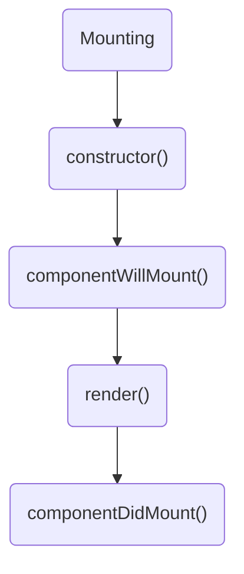
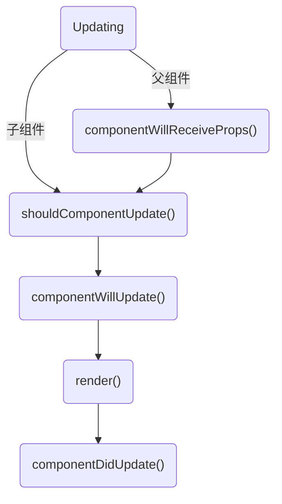
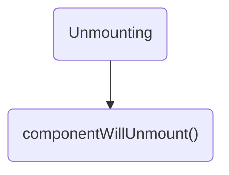

# React

## JSX

JSX JavaScript XML :rocket:

依赖 :pencil: 编译器 Babel 或者 TypeScript 来转换 JSX 成为 JavaScript

可以使用 [createELement](#createelement) 代替 JSX

### 使用 JSX 书写 HTML

JSX 规则:

- 只能返回一个根元素

  多个 JSX 标签需要被一个父元素包裹

  _Fragment_ 标签 `<></>`

- 标签必须闭合

  `` => ``, `<li>` => `<li></li>`

- 使用驼峰式命名法给 ~~所有~~ 大部分属性命名

  `class` => `className`, `stroke-width` => `strokeWidth`

  `aria-*` 和 `data-*` 属性是以带 `-` 符号的 HTML 书写

### 通过 `{}` 使用 JavaScript

`{}` 中使用 js **表达式**, 如

- `{isPacked ? name + ' ✔' : name}`
- `{isPacked && '✔'}`

:no_entry_sign: `if-else` 语句, `switch-case` 语句, 变量声明语句等, 不是表达式，不能出现在 `{}` 中

`{{}}` 是 JSX 中的 CSS 和对象, 如

- `person={{ name:"", inventions: 5}}`
- `style={{ backgroundColor: 'black', color: 'pink'}}`

## 组件

```jsx
function Card({ person, text }) {
  return (
    <div className="card">
      <Avatar person={person} size={100} />
      <p>{text}</p>
    </div>
  )
}
```

### props

props 类似 HTML 标签的属性, 即传入 React 组件的参数信息

如上, 函数式组件 `<Avatar>` 使用时传入 `<Avatar className={} person={} size={}>`, 传入的参数可以是 HTML 预定义的, 如 `className`, 也可以是自定义的, 如 `person`, `size`

:label: 传入的参数储存于 props 对象中,

```jsx
function Avatar(props) {
  let person = props.person
  let size = props.size
  return (
    
  )
}

// 也可以解构使用
function Avatar({ person, size }) {
  // ...
}

// 默认参数
function Avatar({ person, size = 100 }) {
  // ...
}
```

:label: 展开语法为子组件传入参数

```jsx
function Profile(props) {
  return (
    <div className="card">
      <Avatar {...props} />
    </div>
  )
}

// 等价于
function Profile({ person, size }) {
  return (
    <div className="card">
      <Avatar person={person} size={size} />
    </div>
  )
}
```

#### children

`props.children` 为传入的子组件

```jsx
// <Profile>
//   <Avatar></Avatar>
//   <p></p>
// </Profile>

function Profile({ children }) {
  return (
    <div className="card">
      {children}
    <div>
  )
}
```

#### key

渲染列表

```jsx
const products = [
  { title: 'Cabbage', id: '1' },
  { title: 'Garlic', id: '2' },
  { title: 'Apple', id: '3' },
]

const listItems = products.map((product) => (
  <fragment key={product.id}>
    <h1>{product.title}</h1>
    <p>product.id</p>
  </fragment>
))

return <div>{listItems}</div>
```

:warning: **组件不会把 `key` 当作 props 的一部分**

`key` 的存在只对 React 本身起到提示作用, 即使元素的位置在渲染的过程中发生了改变，它提供的 `key` 值也能让 React 在整个生命周期中一直认得它

- `key` 值在兄弟节点之间必须是唯一的。
- `key` 值不能改变

如果组件需要一个 ID，那么请把它作为一个单独的 prop 传给组件：

`<Profile key={id} userId={id} />`

#### 事件处理函数

- 通常在组件 **内部** 定义。
- 名称以 `handle` 开头，后跟事件名称。

```jsx
function Button() {
  function handleClick() {
    // ...
  }
  return <button onClick={handleClick}>click!</button>
}
```

:label: 给子组件传入函数参数

```jsx
function Button({onClick, text}){
  return <button onClick={onClick}>{text}</button>
}

function PlayButton(){
  const text = "Play"
  function handleClick(){
    // ...
  }
  return <Button onClick={handleClick} text=text></Button>
}
```

:label: 事件传播

除了 `onScroll`, 其他所有事件在 React 中都会传播

```jsx
function Toolbar(){
  return (
    <div className="toolbar"
    onClick={()=>{
      //点击 div 只触发<div>的事件
    }}>
    <button
    onClick={()=>{
      // 点击 button 会触发先<button>的事件触发<div>的事件
    }}
    ></button>
    <div>
  )
}
```

`e.stopPropagation()` 阻止事件传播

通过在事件名称末尾添加 `Capture` 来捕获子元素上所有的事件, 即使他们阻止了事件传播, 如在 Toolbar 中使用 `onClickCapture` 赖捕获子类中所有的点击事件 :mag_right:

每个事件的传播阶段 :cyclone:

1. 事件向下传播, 调用 Toolbar 的 `onClickCapture` 处理函数
2. 到被点击的 button 执行 onClick
3. 向上传播, 执行 Toolbar 的 onClick

`e.preventDefault()` 阻止默认浏览器行为

### 保持组件纯粹

#### 纯函数

纯函数符合下面两点:

1. 输入相同，则输出相同
2. 不会更改在该函数调用前就已存在的对象或变量(副作用)

React 中所有的组件都是纯函数, 组件应该只 **返回** 它们的 JSX，而不 **改变** 在渲染前，就已存在的任何对象或变量, 这包括 `props`、`state` 和 `context`

#### 副作用

副作用通常属于 **事件处理程序**, 即使事件处理程序是在你的组件 **内部** 定义的，它们也不会在渲染期间运行

如函数 `add_list(list, item)`, 修改了 `list`; `write_file(file, data)`, 修改了外部文件

若无法为副作用找到合适的事件处理程序，调用组件中的 [`useEffect`](#effect) :hammer_and_wrench:

### 渲染和提交

#### 触发

- 组件的 **初次渲染**

  ```jsx
  const root = createRoot(document.getElementById('root'))
  root.render(<Image />) // 渲染
  ```

- 组件（或者其祖先之一）的 **状态发生了改变**

#### 渲染

- 在初次渲染中， React 将会为标签 **创建 DOM 节点** :fire:
- 在一次重渲染过程中, React 将计算它们的哪些属性（如果有的话）自上次渲染以来已更改。在下一步（提交阶段）之前，它不会对这些信息执行任何操作

#### 提交

- 对于初次渲染， React 会使用 `appendChild()` DOM API 将其创建的所有 DOM 节点放在屏幕上。
- 对于重渲染， React 将应用最少的必要操作（在渲染时计算！），以使得 DOM 与最新的渲染输出相互匹配
  - 当一个组件重新渲染的时候，它的子代也同样会进行重渲染 :repeat:

### State

state 中储存 **状态(状态机)** 和 **数据(变化)**

```jsx
function Button() {
  const [index, setIndex] = useState(0)
  return <button onClick={() => setIndex(index + 1)}></button>
}
```

- `state` 变量 (index) 会保存上次渲染的值
- `state setter` 函数 (setIndex) 可以更新 state 变量并触发 React 重新渲染组件

_构建 state 的原则_

1. 合并关联的 state
2. 避免互相矛盾的 state
3. 避免冗余的 state
4. 避免重复的 state
5. 避免深度嵌套的 state

[参考网页](https://react.docschina.org/learn/choosing-the-state-structure)

#### React 对 state 进行批处理

_替换_

```jsx
function Button() {
  const [count, setCount] = useState(0)
  function handleClick() {
    setCount(count + 1)
    setCount(count + 1)
    setCount(count + 1)
  }
  return <button onclick={handleClick}></button>
  // 点击一次结果为 0->1
}
```

原因是在一次渲染的事件处理函数内部的 count 值总是 **被提前替换为固定的**, 比如在第一次点击时做了 3 遍 `setCount(0 + 1)`

_更新函数_

```jsx
function Button() {
  const [count, setCount] = useState(0)
  function handleClick() {
    setCount((count) => count + 1)
    setCount((count) => count + 1)
    setCount((count) => count + 1)
  }
  return <button onclick={handleClick}></button>
  // 点击一次结果为 0->3
}
```

原因是 React 将 _更新函数_ 加入队列, count 作为返回值传入下一个函数

#### 更新对象

创造一个新对象代替原来对象

React 通过 **浅比较** 判断 state 是否更新

```jsx
function Form() {
  const [person, setPerson] = useState({
    name: 'Niki de Saint Phalle',
    artwork: {
      title: 'Blue Nana',
      city: 'Hamburg',
      image: 'https://i.imgur.com/Sd1AgUOm.jpg',
    },
  })

  function handleCityChange(e) {
    setPerson({
      ...person, // 复制其它字段的数据, 展开运算符只是 浅拷贝 !!!
      artwork: {
        // 替换 artwork 字段
        ...person.artwork, // 复制之前 person.artwork 中的数据
        city: e.target.value, // 改变 city 值
      },
    })
  }

  //...
}
```

使用 _Immer_

1. 运行 `npm install use-immer` 添加 Immer 依赖
2. 用 `import { useImmer } from 'use-immer'` 替换掉 `import { useState } from 'react'`

```jsx
function Form() {
  const [person, updatePerson] = useImmer({
    name: 'Niki de Saint Phalle',
    artwork: {
      title: 'Blue Nana',
      city: 'Hamburg',
      image: 'https://i.imgur.com/Sd1AgUOm.jpg',
    },
  })

  function handleCityChange(e) {
    updatePerson((draft) => {
      draft.artwork.city = e.target.value
    })
  }
}
```

_Immer_ 原理: `draft` 是 Proxy，它会记录你用它所进行的操作

#### 更新数组

|          | 避免使用 (会改变原始数组) | 推荐使用 (会返回一个新数组) |
| -------- | ------------------------- | --------------------------- |
| 添加元素 | push，unshift             | concat， [...arr]           |
| 删除元素 | pop，shift，splice        | filter，slice               |
| 替换元素 | splice，arr[i] =          | map                         |
| 排序     | reverse，sort             | 先将数组复制一份            |

类似更新对象, 注意 **浅拷贝**

使用 _Immer_

```jsx
import { useImmer } from 'use-immer'

let nextId = 3
const initialList = [
  { id: 0, title: 'Big Bellies', seen: false },
  { id: 1, title: 'Lunar Landscape', seen: false },
  { id: 2, title: 'Terracotta Army', seen: true },
]

export default function BucketList() {
  const [List, updateList] = useImmer(initialList)

  function handleToggleList(id, nextSeen) {
    updateMyList((draft) => {
      const artwork = draft.find((a) => a.id === id)
      artwork.seen = nextSeen
    })
  }
}
```

#### state 状态保留和重置

**保留** : 组件在 UI 树中的位置不变

**重置** : 组件在 UI 树中的位置改变

_使在同一位置的组件 state 重置_

1. 将组件渲染在不同的位置

   ```jsx
   const fragment = (
     <div>
       {isPlayerA && <Counter person="Taylor" />}
       {!isPlayerA && <Counter person="Sarah" />}
       <button
         onClick={() => {
           setIsPlayerA(!isPlayerA)
         }}>
         Next!
       </button>
     </div>
   )
   ```

2. 使用 key 来重置 state

   ```jsx
   const fragment = (
     <div>
       {isPlayerA ? (
         <Counter key="Taylor" person="Taylor" />
       ) : (
         <Counter key="Sarah" person="Sarah" />
       )}
       <button
         onClick={() => {
           setIsPlayerA(!isPlayerA)
         }}>
         Next!
       </button>
     </div>
   )
   ```

_使被移除的组件保留 state_

先为不同组件的实例指定 `key`

1. 渲染所有组件, 使用 CSS 隐藏暂时不需要的组件(不算移除)
2. 状态提升
3. 使用其他数据源, 如读取 `localStorage` 对其 state 进行初始化

### 组件的导入和导出

| 语法 |                import                 |                 export                 |
| ---- | :-----------------------------------: | :------------------------------------: |
| 默认 | `export default function Button() {}` |   `import Button from './Button.js'`   |
| 具名 |     `export function Button() {}`     | `import { Button } from './Button.js'` |

### 组件通信

#### 父子组件通信

1. 父 => 子 _状态提升_ , 即父组件有控制子组件状态的 state, 其中子组件可称为 **受控组件**
2. 子 => 父 既然子组件和父组件都需要相同的数据，那么可以让父组件获取那些数据，并将其 **向下传递** 给子组件, 避免子传父

```jsx
import { useState } from 'react'

export default function Accordion() {
  const [activeIndex, setActiveIndex] = useState(0)
  return (
    <>
      <Panel
        title="about"
        isActive={activeIndex === 0}
        onShow={() => setActiveIndex(0)}>
        文案1 ...
      </Panel>
      <Panel
        title="radical"
        isActive={activeIndex === 1}
        onShow={() => setActiveIndex(1)}>
        文案2 ...
      </Panel>
    </>
  )
}

function Panel({ title, children, isActive, onShow }) {
  return (
    <section className="panel">
      <h3>{title}</h3>
      {isActive ? <p>{children}</p> : <button onClick={onShow}>show</button>}
    </section>
  )
}
```

#### Context

_跨越组件传递_

```jsx
import { createContext, useContext, useState } from 'react'
// 定义在组件外
const imageSizeContext = createContext(0)

function App() {
  const [isLarge, setIsLarge] = useState(false)
  const imageSize = isLarge ? 150 : 100
  return (
    <imageSizeContext.Provider value={imageSize}>
      {/* ... 获得 isLarge */}
      {/* 传递 imageSizeContext */}
      <List />
    </imageSizeContext.Provider>
  )
}

function List() {
  // 可已在中间更新给更深层组件的传值
  const imageSize = useContext(imageSizeContext)
  // 设置新值 imageNewSize
  return (
    {/*
    在 value={} 中传入更新后的值
    <imageSizeContext.Provider value={imageNewSize}>
    */}
      <Part></Part>
    {/* </imageSizeContext.Provider> */}
  )
}

function Part() {
  // 使用 imageSizeContext
  const imageSize = useContext(imageSizeContext)
  return 
}
```

## Hook

React Hook 的核心思想是将与组件 [生命周期](#lifecycle) 相关的逻辑分离成可重用的函数，并在函数组件中使用这些函数

### Reducer

用于处理状态, 类比 `Array.reduce()`

```jsx
import { useReducer } from 'react'

function TaskApp() {
  const [task, dispatch] = useReducer(tasksReducer, initialTasks)

  // 1. 将状态逻辑修改成 dispatch 的一个 action
  function handleAddTask(text) {
    dispatch({
      type: 'added',
      id: nextId++,
      text: text,
    })
  }

  function handleChangeTask(task) {
    dispatch({
      type: 'changed',
      task: task,
    })
  }

  function handleDeleteTask(taskId) {
    dispatch({
      type: 'deleted',
      id: taskId,
    })
  }

  return (
    <>
      <h1>布拉格的行程安排</h1>
      <AddTask onAddTask={handleAddTask} />
      <TaskList
        tasks={tasks}
        onChangeTask={handleChangeTask}
        onDeleteTask={handleDeleteTask}
      />
    </>
  )
}
// 2. 编写一个 reducer 函数处理 action, 并返回一个 action
// tasksReducer 第一个参数为 当前状态, 即 tasks 一个数组, 第二个参数为 action 对象
function tasksReducer(tasks, action) {
  switch (action.type) {
    case 'added': {
      return [
        ...tasks,
        {
          id: action.id,
          text: action.text,
          done: false,
        },
      ]
    }
    case 'changed': {
      return tasks.map((t) => {
        if (t.id === action.task.id) {
          return action.task
        } else {
          return t
        }
      })
    }
    case 'deleted': {
      return tasks.filter((t) => t.id !== action.id)
    }
    default: {
      throw Error('未知 action: ' + action.type)
    }
  }
}

// 初始化
let nextId = 3
const initialTasks = [
  { id: 0, text: '参观卡夫卡博物馆', done: true },
  { id: 1, text: '看木偶戏', done: false },
  { id: 2, text: '打卡列侬墙', done: false },
]
```

使用 _Immer_

```jsx
import { useImmerReducer } from 'use-immer'

function TaskApp() {
  const [tasks, dispatch] = useImmerReducer(tasksReducer, initialTasks)

  // ...
}

function tasksReducer(draft, action) {
  switch (action.type) {
    case 'added': {
      draft.push({
        id: action.id,
        text: action.text,
        done: false,
      })
      break
    }
    case 'changed': {
      const index = draft.findIndex((t) => t.id === action.task.id)
      draft[index] = action.task
      break
    }
    case 'deleted': {
      return draft.filter((t) => t.id !== action.id)
    }
    default: {
      throw Error('未知 action：' + action.type)
    }
  }
}
```

### Ref

"记住"某些信息, 同时不触发 **渲染**

- 存储 timeout ID
- 存储和操作 DOM 元素
- 存储不需要被用来计算 JSX 的其他对象。

`useRef(0)` 返回一个对象 `{ current: 0 }`

_存储 `TimeoutID`_

示例: 定时器

```jsx
import { useRef, useState } from 'react'

function StopWatch() {
  // now - startTime 显示经过的时间, 即secondsPassed
  const [startTime, setStartTime] = useState(null)
  const [now, setNow] = useState(null)
  // 由于 interval ID 不用于渲染，将其保存在 ref 中
  const intervalRef = useRef(null)

  let secondsPassed = 0
  if (startTime != null && now != null) {
    secondsPassed = (now - startTime) / 1000
  }

  function handleStart() {
    setStartTime(Date.now())
    setNow(Date.now())
    // 再次点击重置
    clearInterval(intervalRef.current)
    intervalRef.current = setInterval(() => {
      setNow(Date.now())
    }, 10)
  }

  function handleStop() {
    clearInterval(intervalRef.current)
  }

  // ...
}
```

_存储和操作 DOM 元素_

声明一个 `const myRef= useRef(null)` 后, 传入该 ref 到 DOM 结点, 如 `<div ref={myRef}></div>`

示例: 使文本框输入获得焦点

```jsx
import { forwardRef, useRef } from 'react'
// 使用 forwardRef 声明 MyInput 组件, 这可以接收 ref 参数
const MyInput = forwardRef((props, ref) => {
  return <input {...props} ref={ref} />
})

function From() {
  const myInputRef = useRef(null)
  const originalInput = useRef(null)

  function handleClick() {
    // 访问另一个组件的 DOM 节点
    myInputRef.current.focus()
    // 访问自己组件的 DOM 节点
    originalInput.current.focus()
  }

  return (
    <>
      <MyInput ref={myInputRef} />
      <input ref={originalInput} />
      <button onClick={handleClick}>Focus!</button>
    </>
  )
}
```

_使用 ref 回调管理 ref 列表_

在未确定 list 中元素个数的情况下, 如下: :x:

```jsx
<ul>
  {items.map((item) => {
    //Hook 只能在组件的顶层被调用
    const ref = useRef(null)
    return <li ref={ref} />
  })}
</ul>
```

**ref 回调函数** 将函数传递给 ref 属性, 如 `(node) => console.log(node)`

`(node) => { ... }` 在每次渲染时都是一个不同的函数

当组件重新渲染时，先前的函数将被调用并传递 `null` 作为参数，并且下一个函数将被调用并传递对应 DOM 节点作为参数

示例: 滚动至一个元素

```jsx
import { useRef } from 'react'

export default function CatFriends() {
  const itemsRef = useRef(null)

  function getMap() {
    if (!itemsRef.current) {
      // 首次运行时初始化 Map
      itemsRef.current = new Map()
    }
    return itemsRef.current
  }

  // 在 map 中找到对应的 node, 并设置滚动
  function scrollToId(itemId) {
    const map = getMap()
    const node = map.get(itemId)
    node.scrollIntoView({
      behavior: 'smooth',
      block: 'nearest',
      inline: 'center',
    })
  }

  return (
    <>
      <nav>
        <button onClick={() => scrollToId(0)}>Tom</button>
        <button onClick={() => scrollToId(5)}>Maru</button>
        <button onClick={() => scrollToId(9)}>Jellylorum</button>
      </nav>
      <div>
        <ul>
          {catList.map((cat) => (
            <li
              key={cat.id}
              // ref 回调, 绑定 id 和 node
              ref={(node) => {
                const map = getMap()
                if (node) map.set(cat.id, node)
                else map.delete(cat.id)
              }}>
              
            </li>
          ))}
        </ul>
      </div>
    </>
  )
}

const catList = []
for (let i = 0; i < 10; i++) {
  catList.push({
    id: i,
    imageUrl: 'https://url?image=' + i,
  })
}
```

### Effect

与外部系统同步

- 根据 React state 控制非 React 组件
- 设置服务器连接
- 在组件出现在屏幕上时发送分析日志

`Effect` 是由渲染引起的副作用(side effect)

#### 使用

```jsx
// 1. 声明
import { useEffect } from 'react'

function MyComponent() {
  useEffect(() => {
    // 每次渲染后都会执行此处的代码
    return () => {
      // 3. 按需添加清理（cleanup）函数
    }
  })
  // 2. 第二个参数, 依赖项
  // 以下三种情况
  useEffect(() => {
    // 这里的代码会在每次渲染后执行
  })

  useEffect(() => {
    // 这里的代码只会在组件挂载后执行
  }, [])

  useEffect(() => {
    //这里的代码只会在每次渲染后，并且 a 或 b 的值与上次渲染不一致时执行
  }, [a, b])

  // ...
}
```

#### `useEffect` 同步逻辑

现在有一个 `ChatRoom` 组件,

1. `ChatRoom` 组件挂载，`roomId` 设置为 `"general"`
2. `ChatRoom` 组件更新，`roomId` 设置为 `"travel"`
3. `ChatRoom` 组件更新
4. `ChatRoom` 组件卸载

每个 Effect 是一个独立的同步过程,

1. Effect 连接到了 `"general"` 聊天室
2. Effect 使用 `Object.is()` 比较 `roomId`, 发现 `roomId` 改变, 断开了与 "general" 聊天室的连接，并重新同步连接到了 `"travel"` 聊天室
3. `roomId` 没有改变, Effect 保持 `"travel"` 聊天室连接
4. Effect 断开了与 `"travel"` 聊天室的连接

从 Effect 生命周期看,

1. Effect 连接到了 `"general"` 聊天室（直到断开连接）
2. Effect 连接到了 `"travel"` 聊天室（直到断开连接）

React 通过在开发环境中立即强制 Effect 重新进行同步来验证其是否能够重新同步

#### `useEffect` 使用例子

_控制非 React 组件_

假设要向页面添加地图组件，并且它有一个 `setZoomLevel()` 方法用来调整缩放级别（zoom level）并与 React 代码中的 `zoomLevel` state 变量保持同步

```jsx
useEffect(() => {
  const map = mapRef.current
  map.setZoomLevel(zoomLevel)
}, [zoomLevel])
```

_订阅事件_

如果 Effect 订阅了某些事件，清理函数应该退订这些事件

```jsx
useEffect(() => {
  function handleScroll(e) {
    console.log(window.scrollX, window.scrollY)
  }
  window.addEventListener('scroll', handleScroll)
  return () => window.removeEventListener('scroll', handleScroll)
}, [])
```

_触发动画_

如果 Effect 对某些内容加入了动画，清理函数应将动画重置

```jsx
useEffect(() => {
  const node = ref.current
  node.style.opacity = 1 // 触发动画
  return () => {
    node.style.opacity = 0 // 重置为初始值
  }
}, [])
```

_获取数据_

如果 Effect 将会获取数据，清理函数应该要么 **中止该数据获取操作**，要么 **忽略其结果**, 来避免条件竞争

- 条件竞争的原因:

  若 :green_circle: 代表请求数据的时间, :orange_circle: 代表客户端收到数据的时间

  - 理想状态

    :green_circle: :arrow_right: :arrow_right: :orange_circle:

    :zzz: :zzz: :zzz: :zzz: :green_circle: :arrow_right: :arrow_right: :orange_circle:

  - 出现页面闪烁

    :green_circle: :arrow_right: :arrow_right: :orange_circle:

    :zzz: :green_circle: :arrow_right: :arrow_right: :orange_circle:

  - 出现页面错误

    :green_circle: :arrow_right: :arrow_right: :arrow_right: :orange_circle:

    :zzz: :green_circle: :arrow_right: :orange_circle:

- 解决方案:

  - 忽略结果

    ```jsx
    useEffect(() => {
      let active = true

      const fetchData = async () => {
        const response = await fetch(`https://swapi.dev/api/people/${id}/`)
        const data = await response.json()
        if (active) {
          setData(data)
        }
      }

      fetchData()
      return () => {
        active = false
      }
    }, [id])
    ```

  - 中止数据获取操作

    ```jsx
    useEffect(() => {
      const abortController = new AbortController()

      const fetchData = async () => {
        try {
          const response = await fetch(`https://swapi.dev/api/people/${id}/`, {
            signal: abortController.signal,
          })
          const data = await response.json()
          setData(data)
        } catch (error) {
          if (error.name === 'AbortError') {
            // Aborting a fetch throws an error
            // So we can't update state afterwards
          }
          // Handle other request errors here
        }
      }

      fetchData()
      return () => {
        abortController.abort()
      }
    }, [id])
    ```

#### 不需要使用 Effect

_初始化应用时不需要使用 Effect 的情形_

某些逻辑应该只在应用程序启动时运行一次, 比如, 验证登陆状态和加载本地程序数据。将其放在组件之外：

```jsx
if (typeof window !== 'undefined') {
  // 检查是否在浏览器中运行
  checkAuthToken()
  loadDataFromLocalStorage()
}

function App() {
  // ...
}
```

_当 props 变化时重置所有 state_

[使用 key](#state-状态保留和重置)

_当 prop 变化时调整部分 state_

```jsx
function List({ items }) {
  const [isReverse, setIsReverse] = useState(false)
  const [selectedId, setSelectedId] = useState(null)
  // 在渲染期间计算所需内容, 不需要放在 Effect 中
  const selection = items.find((item) => item.id === selectedId) ?? null
  // ...
}
```

_发送 POST 请求_

```jsx
function Form() {
  const [firstName, setFirstName] = useState('')
  const [lastName, setLastName] = useState('')

  // 这个逻辑应该在组件显示时执行
  useEffect(() => {
    post('/analytics/event', { eventName: 'visit_form' })
  }, [])

  function handleSubmit(e) {
    e.preventDefault()
    // 事件特定的逻辑在事件处理函数中处理
    post('/api/register', { firstName, lastName })
  }
  // ...
}
```

_订阅外部 store_

需要订阅 React state 之外的一些数据。这些数据可能来自第三方库或内置浏览器 API

尽管通常可以使用 Effect 来实现此功能, 但 React 为此针对性地提供了一个 Hook 用于订阅外部 store : [`useSyncExternalStore`](https://react.docschina.org/reference/react/useSyncExternalStore)

### 自定义 Hook

需要一个用途更特殊的 Hook：例如获取数据，记录用户是否在线或者连接聊天室

```jsx
// useOnlineStatus.js

function useOnlineStatus() {
  const [isOnline, setIsOnline] = useState(true)
  useEffect(() => {
    function handleOnline() {
      setIsOnline(true)
    }
    function handleOffline() {
      setIsOnline(false)
    }
    window.addEventListener('online', handleOnline)
    window.addEventListener('offline', handleOffline)
    return () => {
      window.removeEventListener('online', handleOnline)
      window.removeEventListener('offline', handleOffline)
    }
  }, [])
  return isOnline
}

// StatusBar.js

import { useOnlineStatus } from './useOnlineStatus.js'

function StatusBar() {
  const isOnline = useOnlineStatus()
  return <h1>{isOnline ? '✅ Online' : '❌ Disconnected'}</h1>
}
```

Hook 的名称必须永远以 use 开头, 这保证你始终能一眼识别出组件并且知道它的 state, Effect 以及其他的 React 特性可能“隐藏”在哪里

自定义 Hook 共享的是状态逻辑，而不是状态本身

## 过时的 React API

仅做了解, 无需使用

### createELement

```jsx
import { createELement } from 'react'

function Greeting({ name }) {
  return createElement(
    'h1', // type 标签名/React组件名
    { className: 'greeting' }, // props
    'Hello ', // ...children 零个或者多个
    createElement('i', null, name)
  )
}

// 等价于

function Greeting() {
  return (
    <h1 className="greeting">
      Hello <i>{name}</i>
    </h1>
  )
}
```

### SomeContext.Consumer

:yellow_circle: 遗留方式

推荐 [`useContext`](#context)

```jsx
function Wrapper() {
  return (
    <ThemeContext.Provider>
      <Button></Button>
    </ThemeContext.Provider>
  )
}

function Button() {
  return (
    <ThemeContext.Consumer>
      {(theme) => <button className={theme} />}
    </ThemeContext.Consumer>
  )
}
```

### Component

类组件使用 [函数式组件](#组件) 代替, 生命周期使用 [effect](#effect) 代替

#### Lifecycle

挂载 -> 更新 -> 卸载


_Mounting_

初始化

❌ `componentWillMount()` 已废弃



_Updating_

❌ `componentWillUpdate()` 已废弃

❌ `componentWillReceiveProps(nextProps)` 已废弃



_Unmounting_

如果在 `componentDidMount()` (挂载)读取了某些 sate 或 props, 如建立连接

使用 `componentDidUpdate()`(更新)处理 `componentDidMount()`的更改

实现 `componentWillUnmount` 来清理 `componentDidMount` 所执行的所有操作, 如断开连接



#### 定义和使用

```jsx
import { Component, createContext } from 'react'

const ThemeContext = createContext('dark')

// 定义
class Greeting extends Component {
  // 使用 context
  static contextType = ThemeContext

  // 默认属性
  static defaultProps = {
    name: 'Nicholas',
  }

  // 检查 props 类型
  static propTypes = {
    name: PropTypes.string,
  }

  // state 类组件不支持 useState
  state = {
    name: 'Taylor',
    age: 42,
  }

  handleNameChange = (e) => {
    // 更新 state
    this.setState({
      name: e.target.value,
    })
  }

  render() {
    return <h1> Hello, {this.props.name}</h1>
  }
}

// 使用
export default function App() {
  return (
    <>
      <Greeting name="Sara" />
      <Greeting name="Cahal" />
      <Greeting name="Edite" />
    </>
  )
}
```
